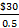
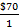

**CHAPTER 11**

**DECISION MAKING AND RELEVANT INFORMATION**

**11-1** The five steps in the decision process outlined in Exhibit 11-1 of the text are

1. Identify the problem and uncertainties.

2. Obtain information.

3. Make predictions about the future.

4. Make decisions by choosing among alternatives.

5. Implement the decision, evaluate performance, and learn.

**11-2** Relevant costs are expected future costs that differ among the alternative courses of action being considered. Historical costs are irrelevant because they are past costs and, therefore, cannot differ among alternative future courses of action.

**11-3** No. Relevant costs are defined as those expected future costs that differ among alternative courses of action being considered. Thus, future costs that do not differ among the alternatives are irrelevant to deciding which alternative to choose.

**11-4** Quantitative factors are outcomes that are measured in numerical terms. Some quantitative factors are financial––that is, they can be easily expressed in monetary terms. Direct materials are an example of a quantitative financial factor. Other quantitative nonfinancial factors, such as on-time flight arrivals, cannot be easily expressed in monetary terms. Qualitative factors are outcomes that are difficult to measure accurately in numerical terms. An example is employee morale.

**11-5** Two potential problems that should be avoided in relevant cost analysis are

(i) Do not assume all variable costs are relevant and all fixed costs are irrelevant.

(ii) Do not use unit-cost data directly. It can mislead decision makers because

> a. it may include irrelevant costs, and
>
> b. comparisons of unit costs computed at different output levels lead to erroneous conclusions.

**11-6** No. Some variable costs may not differ among the alternatives under consideration and, hence, will be irrelevant. Some fixed costs may differ among the alternatives and, hence, will be relevant.

**11-7** No. Some of the total manufacturing cost per unit of a product may be fixed and, hence, will not differ between the make and buy alternatives. These fixed costs are irrelevant to the make-or-buy decision. The key comparison is between purchase costs and the costs that will be saved if the company purchases the component parts from outside plus the additional benefits of using the resources freed up in the next best alternative use (opportunity cost). Furthermore, managers should consider nonfinancial factors such as quality and timely delivery when making outsourcing decisions.

**11-8** cost is the contribution to income that is forgone (rejected) by not using a limited resource in its next-best alternative use.

**11-9** No. When deciding on the quantity of inventory to buy, managers must consider both the purchase cost per unit and the opportunity cost of funds invested in the inventory. For example, the purchase cost per unit may be low when the quantity of inventory purchased is large, but the benefit of the lower cost may be more than offset by the high opportunity cost of the funds invested in acquiring and holding inventory.

**11-10** No. Managers should aim to get the highest contribution margin per unit of the constraining (that is, scarce, limiting, or critical) factor. The constraining factor is what restricts or limits the production or sale of a given product (for example, availability of machine-hours).

**11-11** No. For example, if the revenues that will be lost exceed the costs that will be saved, the branch or business segment should not be shut down. Shutting down will only increase the loss. Allocated costs and fixed costs that will not be saved are irrelevant to the shut-down decision.

**11-12** Cost written off as depreciation is irrelevant when it pertains to a past cost such as equipment already purchased. But the purchase cost of new equipment to be acquired in the future that will then be written off as depreciation is often relevant.

**11-13** No. Managers often favor the alternative that makes their performance look best so they focus on the measures used in the performance-evaluation model. If the performance-evaluation model does not emphasize maximizing operating income or minimizing costs, managers will most likely not choose the alternative that maximizes operating income or minimizes costs.

**11-14** The three steps in solving a linear programming problem are

(i) Determine the objective function.

(ii) Specify the constraints.

(iii) Compute the optimal solution.

**11-15** The text outlines two methods of determining the optimal solution to an LP problem:

(i) Trial-and-error approach

(ii) Graphic approach

Most LP applications in practice use standard software packages that rely on the simplex method to compute the optimal solution.

**
11-16** (20 min.) **Disposal of assets.**

1. This is an unfortunate situation, yet the $76,000 costs are irrelevant regarding the decision to remachine or scrap. The only relevant factors are the future revenues and future costs. By ignoring the accumulated costs and deciding on the basis of expected future costs, operating income will be maximized (or losses minimized). The difference in favor of remachining is $4,500:

**(a) (b)**

**Remachine Scrap**

Future revenues $33,500 $2,500

Deduct future costs *26,500* *– *

Operating income $ 7,000 $2,500

Difference in favor of remachining $4,500

2. This, too, is an unfortunate situation. But the $101,500 original cost is irrelevant to this decision. The difference in relevant costs in favor of replacing is $3,500 as follows:

**(a) (b)**

 Replace Rebuild 
=================

New truck $103,000 –

Deduct current disposal

price of existing truck 18,000 –

Rebuild existing truck – *$88,500*

$ 85,000 $88,500

Difference in favor of replacing $3,500

Note, here, that the current disposal price of $18,000 is relevant, but the original cost (or book value, if the truck were not brand new) is irrelevant.

**
11-17** (20 min.) **Relevant and irrelevant costs**.

1.

|                       | **Make** | **Buy** |
|-----------------------|----------|---------|
| Relevant costs        |          |         |
| Variable costs        | $190     |         |
| Avoidable fixed costs | 10       |         |
| Purchase price        | \_\_\_\_ | *$260*  |
| Unit relevant cost    | $200     | $260    |

DeCesare Computers should reject Peach’s offer. The $80 of fixed costs is irrelevant because it will be incurred regardless of this decision. When comparing relevant costs between the choices, Peach’s offer price is higher than the cost to continue to produce.

2.

|                                       | **Keep**      | **Replace** | **Difference** |
|---------------------------------------|---------------|-------------|----------------|
| Cash operating costs (3 years)        | $52,500       | $46,500     | $6,000         |
| Current disposal value of old machine |               | (2,200)     | 2,200          |
| Cost of new machine                   | \_ \_\_\_\_\_ | *9,000*     | *(9,000*)      |
| Total relevant costs                  | $52,500       | $53,300     | $ (800)        |

LN Manufacturing should keep the old machine. The cost savings are less than the cost to purchase the new machine.

**
11-18** (15 min.) **Multiple choice.**

1. (b) Special order price per unit $6.25

Variable manufacturing cost per unit *5.00*

Contribution margin per unit $1.25

Effect on operating income = $1.25 × 5,000 units

= $6,250 increase

2. (b) Costs of purchases, 30,000 units × $47 $1,410,000

Total relevant costs of making:

Variable manufacturing costs, $5 + $22 + $8 $35

Fixed costs eliminated *8*

Costs saved by not making $43

Multiply by 30,000 units, so total

costs saved are $43 × 30,000 *1,290,000*

Extra costs of purchasing outside 120,000

Minimum overall savings for Sacramento *30,000*

Necessary relevant costs that would have

to be saved in manufacturing Part No. 575 $ 150,000

Before outsourcing to Counter, Sacramento must consider the consequence of increasing its dependence on Counter. Sacramento would want to be sure about the quality of Counter’s product and the reliability of its delivery schedules over a long-run period. Sacramento would also want Counter to continuously reduce costs. To achieve all these goals, Sacramento may want to build close partnerships and alliances with Counter.

**
11-19** (30 min.) **Special order, activity-based costing.**

1. Direct materials cost per unit ($350,000 ÷ 10,000 units) = $35 per unit

> Direct manufacturing labor cost per unit ($375,000 ÷ 10,000 units) = $37.50 per unit
>
> Variable cost per batch = $500 per batch

Gold Plus’ operating income under the alternatives of accepting/rejecting the special order are:

|     |                                         |                                      |                 |
|-----|-----------------------------------------|--------------------------------------|-----------------|
|     | **Without One-Time Only Special Order** 
                                                
       **10,000 Units**                         | **With One-Time Only Special Order** 
                                                                                       
                                                 **11,000 Units**                      | **Difference ** 
                                                                                                         
                                                                                        **1,000 Units**  |

Revenues *$1,500,000* *$1,600,000* *$100,000*

Variable costs:

> Direct materials 350,000 385,0001 35,000
>
> Direct manufacturing labor 375,000 412,5002 37,500
>
> Batch manufacturing costs 100,000 112,5003 12,500

Fixed costs:

> Fixed manufacturing costs 300,000 300,000 ––
>
> Fixed marketing costs *275,000* *275,000* *–– *

Total costs *1,400,000* *1,485,000* *85,000*

Operating income $ 100,000 $ 115,000 $ 15,000

1$350,000 + ($35 × 1,000 units) 2$375,000 + ($37.50 × 1,000 units) 3$100,000 + ($500 × 25 batches)

Alternatively, we could calculate the incremental revenue and the incremental costs of the additional 1,000 units as follows:

> Incremental revenue $100 × 1,000 *$100,000*
>
> Incremental direct manufacturing costs $35 × 1,000 units 35,000
>
> Incremental direct manufacturing costs $37.50 × 1,000 units 37,500
>
> Incremental batch manufacturing costs $500 × 25 batches *12,500*
>
> Total incremental costs *85,000*
>
> Total incremental operating income from
>
> accepting the special order $ 15,000

Gold Plus should accept the one-time-only special order if it has no long-term implications because accepting the order increases Gold Plus’ operating income by $15,000.

If, however, accepting the special order would cause the regular customers to be dissatisfied or to demand lower prices, then Gold Plus will have to trade off the $15,000 gain from accepting the special order against the operating income it might lose from regular customers.

2. Gold Plus has a capacity of 10,500 medals. Therefore, if it accepts the special one-time order of 1,000 medals, it can sell only 9,500 medals instead of the 10,000 medals that it currently sells to existing customers. That is, by accepting the special order, Gold Plus must forgo sales of 500 medals to its regular customers. Alternatively, Gold Plus can reject the special order and continue to sell 9,500 medals to its regular customers.

Gold Plus’ operating income from selling 9,500 medals to regular customers and 1,000 medals under one-time special order follow:

> Revenues (9,500 × $150) + (1,000 × $100) *$1,525,000*
>
> Direct materials (9,500 × $35) + (1,000 × $35) 367,500
>
> Direct manufacturing labor (9,500 × $37.50) + (1,000 × $37.50) 393,750
>
> Batch manufacturing costs (1901 × $500) + (25 × $500) 107,500
>
> Fixed manufacturing costs 300,000
>
> Fixed marketing costs *275,000*
>
> Total costs *1,443,750*
>
> Operating income $ 81,250

1Gold Plus makes regular medals in batch sizes of 50. To produce 9,500 medals requires 190 (9,500 ÷ 50) batches.

Accepting the special order will result in a decrease in operating income of $18,750 ($100,000 – $81,250). The special order should, therefore, be rejected.

A more direct approach would be to focus on the incremental effects––the benefits of accepting the special order of 1,000 units versus the costs of selling 500 fewer units to regular customers. Increase in operating income from the 1,000-unit special order equals $15,000 (requirement 1). The loss in operating income from selling 500 fewer units to regular customers equals:

> Lost revenue, $150 × 500 $(75,000)
>
> Savings in direct materials costs, $35 × 500 17,500
>
> Savings in direct manufacturing labor costs, $37.50 × 500 18,750
>
> Savings in batch manufacturing costs, $500 × 10 *5,000*
>
> Operating income lost $(33,750)

Accepting the special order will result in a decrease in operating income of $18,750 ($15,000 – $33,750). The special order should, therefore, be rejected.

Even if operating income had increased by accepting the special order, Gold Plus should consider the effect on its regular customers of accepting the special order. For example, would selling 1,000 fewer medals to its regular customers cause these customers to find new suppliers that might adversely impact Gold Plus’s business in the long run.

3. Gold Plus should not accept the special order.

> Increase in operating income by selling 1,000 units
>
> under the special order (requirement 1) $ 15,000
>
> Operating income lost from existing customers ($10 × 10,000) *(100,000*)
>
> Net effect on operating income of accepting special order $ (85,000)
>
> The special order should, therefore, be rejected.

**
11-20** (30 min.) **Make versus buy, activity-based costing.**

1. The expected manufacturing cost per unit of CMCBs in 2015 is as follows:

|                                                 |                                       |                                 |
|-------------------------------------------------|---------------------------------------|---------------------------------|
|                                                 | **Total Manufacturing Costs of CMCB** 
                                                                                          
                                                   **(1)**                                | **Manufacturing Cost per Unit** 
                                                                                                                            
                                                                                           **(2) = (1) ÷ 10,000**           |
| Direct materials, $170 × 10,000                 
                                                  
 Direct manufacturing labor, $45 × 10,000         
                                                  
 Variable batch manufacturing costs, $1,500 × 80  
 -----------------------------------------------  
                                                  
 Fixed manufacturing costs                        
                                                  
 > Avoidable fixed manufacturing costs            
 >                                                
 > Unavoidable fixed manufacturing costs          
                                                  
 Total manufacturing costs                        | $1,700,000                            
                                                                                          
                                                   450,000                                
                                                                                          
                                                   120,000                                
                                                                                          
                                                   320,000                                
                                                                                          
                                                   *800,000*                              
                                                                                          
                                                   $3,390,000                             | $170                            
                                                                                                                            
                                                                                           45                               
                                                                                                                            
                                                                                           12                               
                                                                                                                            
                                                                                           32                               
                                                                                                                            
                                                                                           *80*                             
                                                                                                                            
                                                                                           $339                             |

2. The following table identifies the incremental costs in 2015 if Svenson (a) made CMCBs and (b) purchased CMCBs from Minton.

|                                      |                       |                       |
|--------------------------------------|-----------------------|-----------------------|
|                                      | **Total**             
                                                               
                                        **Incremental Costs**  | **Per-Unit**          
                                                                                       
                                                                **Incremental Costs**  |
| **Incremental Items**                | **Make**              | **Buy**               |
| Cost of purchasing CMCBs from Minton 
                                       
 Direct materials                      
                                       
 Direct manufacturing labor            
                                       
 Variable batch manufacturing costs    
                                       
 Avoidable fixed manufacturing costs   
                                       
 Total incremental costs               | $1,700,000            
                                                               
                                        450,000                
                                                               
                                        120,000                
                                                               
                                        *320,000*              
                                                               
                                        $2,590,000             | $3,000,000            
                                                                                       
                                                                $3,000,000             |
| Difference in favor of making        | **$**410,000          | $41                   |

Note that the opportunity cost of using capacity to make CMCBs is zero because Svenson would keep this capacity idle if it purchases CMCBs from Minton.

Svenson should continue to manufacture the CMCBs internally because the incremental costs to manufacture are $259 per unit compared to the $300 per unit that Minton has quoted. Note that the unavoidable fixed manufacturing costs of $800,000 ($80 per unit) will continue to be incurred whether Svenson makes or buys CMCBs. These are not incremental costs under either the make or the buy alternative and, hence, are irrelevant.

3. Svenson should continue to make CMCBs. The simplest way to analyze this problem is to recognize that Svenson would prefer to keep any excess capacity idle rather than use it to make CB3s. Why? Because expected incremental future revenues from CB3s, $2,000,000, are *less* than expected incremental future costs, $2,150,000. If Svenson keeps its capacity idle, we know from requirement 2 that it should make CMCBs rather than buy them.

An important point to note is that, because Svenson forgoes no contribution by not being able to make and sell CB3s, the opportunity cost of using its facilities to make CMCBs is zero. It is, therefore, not forgoing any profits by using the capacity to manufacture CMCBs. If it does not manufacture CMCBs, rather than lose money on CB3s, Svenson will keep capacity idle.

A longer and more detailed approach is to use the total alternatives or opportunity cost analyses shown in Exhibit 11-7 of the chapter.

|                                                                                                                                              |                                     |
|----------------------------------------------------------------------------------------------------------------------------------------------|-------------------------------------|
|                                                                                                                                              | **Choices for Svenson**             |
| **Relevant Items**                                                                                                                           | **Make CMCBs and Do Not Make CB3s** |
| Total-Alternatives approach to Make-or-Buy Decisions                                                                                         |
| Total incremental costs of making/buying CMCBs (from requirement 2)                                                                          
                                                                                                                                               
 Because incremental future costs exceed incremental future revenues from CB3s, Svenson will make zero CB3s even if it buys CMCBs from Minton  
                                                                                                                                               
 Total relevant costs                                                                                                                          | $2,590,000                          
                                                                                                                                                                                     
                                                                                                                                                *0*                                  
                                                                                                                                                                                     
                                                                                                                                                $2,590,000                           |

Svenson will minimize manufacturing costs and maximize operating income by making CMCBs.

OPPORTUNITY-COST APPROACH TO MAKE-OR-BUY DECISIONS

|                                                                                              |                  |            |
|----------------------------------------------------------------------------------------------|------------------|------------|
| Total incremental costs of making/buying CMCBs (from requirement 2)                          | $2,590,000       | $3,000,000 |
| Opportunity cost: profit contribution forgone because capacity will not be used to make CB3s | *0*\* | *0*        |
| Total relevant costs                                                                         | $2,590,000       | $3,000,000 |

\*Opportunity cost is zero because Svenson does not give up anything by not making CB3s. Svenson is best off leaving the capacity idle (rather than manufacturing and selling CB3s).

**
11-21** (10 min.) **Inventory decision, opportunity costs.**

1. Unit cost, orders of 17,000 $9.00

Unit cost, order of 204,000 (0.98 × $9.00) $8.82

*Alternatives under consideration*:

(a) Buy 204,000 units at start of year.

(b) Buy 17,000 units at start of each month.

*Average investment in inventory:*

(a) (204,000 × $8.82) ÷ 2 $899,640

(b) (17,000 × $9.00) ÷ 2 *76,500*

Difference in average investment $823,140

Opportunity cost of interest forgone from 204,000-unit purchase at start of year

= $823,140 × 0.10 = $82,314

2. No. The $82,314 is an opportunity cost rather than an incremental or outlay cost. No actual transaction records the $82,314 as an entry in the accounting system.

3. The following table presents the two alternatives:

|                                                                                                         |                                      |                                |                     |
|---------------------------------------------------------------------------------------------------------|--------------------------------------|--------------------------------|---------------------|
|                                                                                                         | **Alternative A:**                   
                                                                                                                                                 
                                                                                                           **Purchase 204,000 **                 
                                                                                                                                                 
                                                                                                           **spark plugs at beginning of year**  
                                                                                                                                                 
                                                                                                           **(1)**                               | **Alternative B:**             
                                                                                                                                                                                  
                                                                                                                                                  **Purchase **                   
                                                                                                                                                                                  
                                                                                                                                                  **17,000 **                     
                                                                                                                                                                                  
                                                                                                                                                  **spark plugs**                 
                                                                                                                                                                                  
                                                                                                                                                  **at beginning of each month**  
                                                                                                                                                                                  
                                                                                                                                                  **(2)**                         | **Difference**      
                                                                                                                                                                                                        
                                                                                                                                                                                   **(3) = (1) – (2)**  |
| Annual purchase-order costs                                                                             
                                                                                                          
 (1 × $260; 12 × $260)                                                                                    
                                                                                                          
 Annual purchase (incremental) costs                                                                      
                                                                                                          
 (204,000 × $8.82; 204,000 × $9)                                                                          
                                                                                                          
 Annual interest income that could be earned if investment in inventory were invested (opportunity cost)  
                                                                                                          
 (10% × $899,640; 10% × $76,500)                                                                          
                                                                                                          
 Relevant costs                                                                                           | $ 260                                
                                                                                                                                                 
                                                                                                           1,799,280                             
                                                                                                                                                 
                                                                                                           * 89,964*                             
                                                                                                                                                 
                                                                                                           $1,889,504                            | $ 3,120                        
                                                                                                                                                                                  
                                                                                                                                                  1,836,000                       
                                                                                                                                                                                  
                                                                                                                                                  *7,650*                         
                                                                                                                                                                                  
                                                                                                                                                  $1,846,770                      | $ (2,860)           
                                                                                                                                                                                                        
                                                                                                                                                                                   (36,720)             
                                                                                                                                                                                                        
                                                                                                                                                                                   *82,314*             
                                                                                                                                                                                                        
                                                                                                                                                                                   $42,734              |

Column (3) indicates that purchasing 17,000 spark plugs at the beginning of each month is preferred relative to purchasing 204,000 spark plugs at the beginning of the year because the opportunity cost of holding larger inventory exceeds the lower purchasing and ordering costs.

4. If other incremental benefits of holding lower inventory such as lower insurance, materials handling, storage, obsolescence, and breakage costs were considered, the costs under Alternative A would have been higher, and Alternative B would be preferred even more.

**
11-22** (20–25 min.) **Relevant costs, contribution margin, product emphasis.**

|     |          |              |           |             |
|-----|----------|--------------|-----------|-------------|
| 1.  | **Cola** | **Lemonade** | **Punch** | **Natural** 
                                                          
                                             **Juice**    |

Selling price $18.80 $20.75 $26.90 $39.30

Deduct variable cost per case *13.80* *16.25* *20.10* *30.10*

Contribution margin per case $ 5.00 $ 4.50 $ 6.80 $ 9.20

2. The argument fails to recognize that shelf space is the constraining factor. There are only 12 feet of front shelf space to be devoted to drinks. Sexton should aim to get the highest daily contribution margin per foot of front shelf space:

|     |          |              |           |             |
|-----|----------|--------------|-----------|-------------|
|     | **Cola** | **Lemonade** | **Punch** | **Natural** 
                                                          
                                             **Juice**    |

Contribution margin per case $ 5.00 $ 4.50 $ 6.80 $ 9.20

Sales (number of cases) per foot

of shelf space per day *× 7* *× 12* *× 24* *× 6*

Daily contribution per foot

of front shelf space $35.00 $54.00 $163.20 $55.20

3. The allocation that maximizes the daily contribution from soft drink sales is:

|                      |                 |                        |                        |
|----------------------|-----------------|------------------------|------------------------|
|                      |                 | **Daily Contribution** |                        |
|                      | **Feet of**     | **per Foot of **       | **Total Contribution** |
|                      | **Shelf Space** | **Front Shelf Space**  | **Margin per Day**     |
| Punch                | 6               | $163.20                | $ 979.20               |
| Natural Orange Juice | 4               | 55.20                  | 220.80                 |
| Lemonade             | 1               | 54.00                  | 54.00                  |
| Cola                 | 1               | 35.00                  | *35.00*                |
|                      |                 |                        | $1,289.00              |

The maximum of six feet of front shelf space will be devoted to Punch because it has the highest contribution margin per unit of the constraining factor. Four feet of front shelf space will be devoted to Natural Orange Juice, which has the second highest contribution margin per unit of the constraining factor. No more shelf space can be devoted to Natural Orange Juice because each of the remaining two products, Lemonade and Cola (that have the second lowest and lowest contribution margins per unit of the constraining factor), must each be given at least one foot of front shelf space.

**
11-23** (10 min.) **Selection of most profitable product.**

**Note: In some print versions of the text, the column headings appear as Model A and Model B. The column headings in the problem should be Model 9 instead of Model A and Model 14 instead of Model B.**

Only Model 14 should be produced. The key to this problem is the relationship of manufacturing overhead to each product. Note that it takes twice as long to produce Model 9; machine-hours for Model 9 are twice that for Model 14. Management should choose the product mix that maximizes operating income for a given production capacity (the scarce resource in this situation). In this case, Model 14 will yield a $49 contribution to fixed costs per machine hour, and Model 9 will yield $32:

|                                                   |             |              |
|---------------------------------------------------|-------------|--------------|
|                                                   | **Model 9** | **Model 14** |
| Selling price                                     
                                                    
 Variable cost per unit\*                           
                                                    
 ($26 + $20 + $10 + $10; $20 + $16 + $11 + $9)      
                                                    
 Contribution margin per unit                       
                                                    
 Relative use of machine-hours per unit of product  
                                                    
 Contribution margin per machine hour               | $130.00     
                                                                  
                                                     *66.00*      
                                                                  
                                                     $ 64.00      
                                                                  
                                                     *÷ 2*        
                                                                  
                                                     $ 32.00      | $105.00      
                                                                                 
                                                                   *56.00*       
                                                                                 
                                                                   $ 49.00       
                                                                                 
                                                                   *÷ 1*         
                                                                                 
                                                                   $ 49.00       |

> \*Variable cost per unit = Direct material cost per unit + Direct manufacturing labor cost per unit + Variable manufacturing cost per unit + Variable marketing cost per unit.

**
11-24** (25 min.) **Theory of constraints, throughput contribution, relevant costs.**

1. Finishing is a bottleneck operation. Therefore, producing 1,150 more units will generate additional contribution (throughput) margin and operating income.

> Increase in contribution (throughput) margin ($70 – $30) × 1,150 $46,000
>
> Incremental costs of the jigs and tools *35,000*
>
> Increase in operating income investing in jigs and tools $11,000

Pierce should invest in the modern jigs and tools because the benefit of higher contribution (throughput) margin of $46,000 exceeds the cost of $35,000.

2. The Machining Department has excess capacity and is not a bottleneck operation. Increasing its capacity further will not increase contribution (throughput) margin. There is, therefore, no benefit from spending $4,000 to increase the Machining Department's capacity by 9,000 units. Pierce should not implement the change to do setups faster.

3. Finishing is a bottleneck operation. Therefore, getting an outside contractor to produce 9,500 units will increase contribution (throughput) margin.

> Increase in contribution (throughput) margin ($70 – $30) × 9,500 $380,000
>
> Incremental contracting costs $9 × 9,500 *85,500*
>
> Increase in operating income by contracting 9,500 units of finishing $294,500

Pierce should contract with an outside contractor to do 9,500 units of finishing at $9 per unit because the benefit of higher throughput margin of $380,000 exceeds the cost of $85,500. The fact that the cost of $9 per unit is three times Pierce's finishing cost of $3 per unit is irrelevant.

4. Operating costs in the Machining Department of $540,000, or $6 per unit, are fixed costs. Pierce will not save any of these costs by subcontracting machining of 5,000 units to Hammond Corporation. Total costs will be greater by $15,000 ($3 per unit × 5,000 units) under the subcontracting alternative. Machining more filing cabinets will not increase contribution (throughput) margin, which is constrained by the finishing capacity. Pierce should not accept Hammond’s offer. The fact that Hammond’s costs of machining per unit are half of what it costs Pierce in-house is irrelevant.

5. The cost of 1,700 defective units in the Machining Operation is $30 per unit × 1,700 units = $51,000. Because the Machining Operation has a capacity of 110,000 units, it can still produce and transfer 90,000 good units to the Finishing Operation. There is, therefore, no opportunity cost of producing defective units in the Machining Operation.

6. The cost of 1,700 defective units in the Finishing Operation is:

Cost of direct materials used in the defective units $30 per unit × 1,700 units $ 51,000

Opportunity cost, lost contribution (throughput) margin $40 per unit × 1,700 units *68,000*

Total cost of defective unit in the Finishing Operation $119,000

Alternatively, the cost of 1,700 defective units in the Finishing Operation equals the revenues lost by selling 1,700 fewer units = $70 per unit × 1,700 units = $119,000. The cost of the defective unit at a bottleneck operation is much higher than at a non-bottleneck operation because of the opportunity cost of lost contribution margin at the bottleneck operation.

**
11-25** (25−30 min.) **Closing and opening stores.**

1. Solution Exhibit 11-25, Column 1, presents the relevant loss in revenues and the relevant savings in costs from closing the store. Lopez is correct that Sanchez Corporation’s operating income would increase by $7,000 if it closes down the store. Closing down the store results in a loss of revenues of $860,000 but cost savings of $867,000 (from cost of goods sold, rent, labor, utilities, and corporate costs). Note that by closing down the store, Sanchez Corporation will save none of the equipment-related costs because this is a past cost. Also note that the relevant corporate overhead costs are the actual corporate overhead costs $44,000 that Sanchez expects to save by closing the store. The corporate overhead of $40,000 allocated to the Rhode Island store is irrelevant to the analysis.

2. Solution Exhibit 11-25, Column 2, presents the relevant revenues and relevant costs of opening another store like the store. Lopez is correct that opening such a store would increase Sanchez Corporation’s operating income by $11,000. Incremental revenues of $860,000 exceed the incremental costs of $849,000 (from higher cost of goods sold, rent, labor, utilities, and some additional corporate costs). Note that the cost of equipment written off as depreciation is relevant because it is an expected future cost that Sanchez will incur only if it opens the new store. Also note that the relevant corporate overhead costs are the $4,000 of actual corporate overhead costs that Sanchez expects to incur as a result of opening the new store. Sanchez may, in fact, allocate more than $4,000 of corporate overhead to the new store, but this allocation is irrelevant to the analysis.

The key reason that Sanchez’s operating income increases either if it closes down the store or if it opens another store like it is the behavior of corporate overhead costs. By closing down the store, Sanchez can significantly reduce corporate overhead costs presumably by reducing the corporate staff that oversees the operation. On the other hand, adding another store like Rhode Island does not increase actual corporate costs by much, presumably because the existing corporate staff will be able to oversee the new store as well.

**SOLUTION EXHIBIT 11-25**

Relevant-Revenue and Relevant-Cost Analysis of Closing Store and Opening Another Store Like It.

**Incremental** (**Loss in Revenues) Revenues and**

**and Savings in (Incremental Costs)**

**Costs from Closing of Opening New Store**

**Store Like Store**

> **(1) (2)**
>
> Revenues $(860,000) $ 860,000
>
> Cost of goods sold 660,000 (660,000)
>
> Lease rent 75,000 (75,000)
>
> Labor costs 42,000 (42,000)
>
> Depreciation of equipment 0 (22,000)
>
> Utilities (electricity, heating) 46,000 (46,000)
>
> Corporate overhead costs *44,000* *(4,000*)
>
> Total costs *867,000* *(849,000*)
>
> Effect on operating income (loss) $ 7,000 $ 11,000

**
11-26** (20 min.) **Choosing customers. **

If Rodeo accepts the additional business from Julie, it would take an additional 500 machine-hours. If Rodeo accepts all of Julie’s and Trent’s business for February, it would require 5,000 machine-hours (3,000 hours for Trent and 2,000 hours for Julie). Rodeo has only 4,000 hours of machine capacity. It must, therefore, choose how much of the Trent or Julie business to accept.

To maximize operating income, Rodeo should maximize contribution margin per unit of the constrained resource. (Fixed costs will remain unchanged at $170,000 regardless of the business Rodeo chooses to accept in February and are, therefore, irrelevant.) The contribution margin per unit of the constrained resource for each customer in January is:

**Trent Julie**

***Corporation Corporation ***

Contribution margin per machine-hour = $42 = $55

Because the $140,000 of additional Julie business in February is identical to jobs done in January, it will also have a contribution margin of $55 per machine-hour, which is greater than the contribution margin of $42 per machine-hour from Trent. To maximize operating income, Rodeo should first allocate all the capacity needed to take the Julie Corporation business (2,000 machine-hours) and then allocate the remaining 2,000 (4,000 – 2,000) machine-hours to Trent.

**Trent Julie**

 ***Corporation** **Corporation** **Total** *
---------------------------------------------

Contribution margin per machine-hour $42 $55

Machine-hours to be worked *× 2,000* *× 2,000*

Contribution margin $84,000 $110,000 $194,000

Fixed costs *170,000*

Operating income $ 24,000

An alternative approach is to use the opportunity cost approach. The opportunity cost of giving up 1,000 machine-hours for the Trent Corporation jobs is the contribution margin forgone of $42 per machine-hour × 1,000 machine-hours equal to $42,000. The contribution margin gained from using the 1,000 machine-hours for the Julie Corporation business is the contribution margin per machine-hour of $55 × 1,000 machine-hours equal to $55,000.

The net benefit is:

| Contribution margin from Julie Corporation business              | $55,000    |
|------------------------------------------------------------------|------------|
| Less: Opportunity cost (of giving up Trent Corporation business) | *(42,000*) |
| Net benefit                                                      | $13,000    |

Although taking the Julie Corporation business over the Trent Corporation business will maximize Rodeo’s profits in the short run, Rodeo’s managers must also consider the long-run effects of this decision. Will Julie Corporation continue to demand the same level of business going forward? Will turning down the Trent business affect customer satisfaction? If Rodeo turns down the Trent business, will Trent continue to place orders with Rodeo or seek alternative suppliers? Rodeo’s managers need to consider these long-run effects and then decide whether it should accept Julie’s business at the cost of Trent’s. In other words, choosing customers is a strategic decision. If it sees long-run benefit in working with Trent, Rodeo’s managers must also look for ways to increase the profitability of the business it does with Trent by increasing prices or reducing costs.

**11-27** (20 min.) **Relevance of equipment costs.**

1. The current market value and annual operating costs of the old oven, and the purchase price, installation cost, and annual operating costs of the new oven are relevant when deciding whether to replace the oven because these are future costs that would differ between the alternatives of keeping or replacing the old oven.

2. The original cost and book value of the old oven are irrelevant because they are variations of the same past (sunk) cost. All past costs are irrelevant because past costs will be the same whether Papa’s Pizza keeps or replaces the oven. No decision can change what has already been incurred in the past.

3. Papa’s Pizza should purchase the new oven, based on the following calculations:

| **Keep the old oven**                     | **Replace the old oven** |
|-------------------------------------------|--------------------------|
|                                           |                          |
|                                           |                          |
|                                           |                          |
| Operating costs for 5 years ($14,000 × 5) | *$(70,000)*              |
| Cost of keeping the old oven              | $(70,000)                |

The cost of replacing the old oven is $65,000, while the cost of continuing to operate the old oven is $70,000.

4. The manager may be reluctant to replace because it might reflect badly on him for having purchased the old oven in the first place if the new oven was available a year earlier.

5. At a purchase price of $80,000, Papa’s Pizza would be indifferent between purchasing the new oven and continuing to use the old oven ($75,000 current purchase price + $5,000 savings above). Note that a cost of $80,000, the cost of replacing the old oven would be $70,000, equal to the cost of keeping the old oven.
**11-28** (30 min.) **Equipment upgrade versus replacement**.

1.  Based on the analysis in the table below, TechGuide will be better off by $337,500 over three years if it replaces the current equipment.

|                                                     |                  |                   |
|-----------------------------------------------------|------------------|-------------------|
|                                                     | **Over 3 years** | **Difference in** |
| ** Comparing Relevant Costs of Upgrade and**        | **Upgrade**      | **Replace**       |
| ** Replace Alternatives**                           | **(1)**          | **(2)**           |
| Cash operating costs                                |                  |                   |
| $150; $75 per desk 7,500 desks per yr. 3 yrs.       | $3,375,000       | $1,687,500        |
| Current disposal price                              |                  | (450,000)         |
| One time capital costs, written off periodically as 
                                                      
 depreciation                                         | *3,000,000*      | *4,800,000*       |
| Total relevant costs                                | $6,375,000       | $6,037,500        |

Note that the book value of the current machine, $1,800,000 × = $1,080,000 would either be written off as depreciation over three years under the upgrade option or all at once in the current year under the replace option. Its net effect would be the same in both alternatives: to increase costs by $1,080,000 over three years; hence, it is irrelevant in this analysis.

2. Suppose the capital expenditure to replace the equipment is $X. From requirement 1, column (2), substituting for the one-time capital cost of replacement, the relevant cost of replacing is $1,687,500 – $450,000 + $X. From column (1), the relevant cost of upgrading is $6,375,000. We want to find X such that

$1,687,500 – $450,000 + $X &lt; $6,375,000 (i.e., TechGuide will favor replacing)

Solving the above inequality gives us X &lt; $6,375,000 – $1,237,500 = $5,137,500.

TechGuide would prefer to replace, rather than upgrade, if the replacement cost of the new equipment does not exceed $5,137,500. Note that this result can also be obtained by taking the original replacement cost of $4,800,000 and adding to it the $337,500 difference in favor of replacement calculated in requirement 1.

3. Suppose the units produced and sold over 3 years equal *y*. Using data from requirement 1, column (1), the relevant cost of upgrade would be $150*y* + $3,000,000, and from column (2), the relevant cost of replacing the equipment would be $75*y* – $450,000 + $4,800,000. TechGuide would want to upgrade when

$150*y* + $3,000,000 &lt; $75*y* – $450,000 + $4,800,000

$75*y* &lt; $1,350,000

*y* &lt; $1,350,000 ÷ $75 = 18,000 units

That is, upgrade when *y* &lt; 18,000 units (or 6,000 per year for 3 years) and replace when *y* &gt; 18,000 units over 3 years.

When production and sales volume is low (less than 6,000 per year), the higher operating costs under the upgrade option are more than offset by the savings in capital costs from upgrading. When production and sales volume is high, the higher capital costs of replacement are more than offset by the savings in operating costs in the replace option.

4. Operating income for the first year under the upgrade and replace alternatives are shown below:

|                                                                                                                                           |               |
|-------------------------------------------------------------------------------------------------------------------------------------------|---------------|
|                                                                                                                                           | **Year 1**    |
|                                                                                                                                           | **Upgrade**   |
|                                                                                                                                           | **(1)**       |
| Revenues (7,500 $750)                                                                                                                     | *$5,625,000*  |
| Cash operating costs                                                                                                                      |               |
| $150; $75 per desk 7,500 desks per year                                                                                                   | 1,125,000     |
| Depreciation ($1,080,000a + $3,000,000)3; $4,800,0003                                                                          | 1,360,000     |
| Loss on disposal of old equipment (0; $1,080,000 – $450,000)                                                                              | *0*           |
| Total costs                                                                                                                               | *  2,485,000* |
| Operating Income                                                                                                                          | $3,140,000    |
|                                                                                                                                           |               |
| aThe book value of the current production equipment is $1,800,000 5 3 = $1,080,000; it has a remaining useful life of 3 years. |

First-year operating income is higher by $307,500 ($3,140,000 – $2,832,500) under the upgrade alternative, and Dan Doria, with his one-year horizon and operating income-based bonus, will choose the upgrade alternative, even though, as seen in requirement 1, the replace alternative is better in the long run for TechGuide. This exercise illustrates the possible conflict between the decision model and the performance evaluation model.

**
11-29** (20 min.) **Special Order**3

1.

| Revenues from special order ($2310,000 bats)              | $230,000    |
|-----------------------------------------------------------|-------------|
| Variable manufacturing costs ($20110,000 bats) | *(200,000*) |
| Increase in operating income if Bench order accepted      | $ 30,000    |

1Direct materials cost per unit + Direct manufacturing labor cost per unit + Variable manufacturing overhead cost per unit = $13 + $5 + $2 = $20

Slugger should accept Bench’s special order because it increases operating income by $30,000. Because no variable selling costs will be incurred on this order, this cost is irrelevant. Similarly, fixed costs are irrelevant because they will be incurred regardless of the decision.

| 2a. Revenues from special order ($2310,000 bats)                   | $230,000    |
|--------------------------------------------------------------------|-------------|
| Variable manufacturing costs ($2010,000 bats)                      | (200,000)   |
| Contribution margin foregone (\[$36─$231\] 10,000 bats) | *(130,000*) |
| Decrease in operating income if Bench order accepted               | $(100,000)  |

1Direct materials cost per unit + Direct manufacturing labor cost per unit + Variable manufacturing overhead cost per unit + Variable selling expense per unit = $13 + $5 + $2 + $3 = $23

Based strictly on financial considerations, Slugger should reject Bench’s special order because it results in a $100,000 reduction in operating income.

2b. Slugger will be indifferent between the special order and continuing to sell to regular customers if the special order price is $33. At this price, Slugger recoups the variable manufacturing costs of $200,000 and the contribution margin given up from regular customers of $130,000 (\[$200,000 + $130,000\] ÷ 10,000 units = $33). That is, at the special order price of $33, Slugger recoups the variable cost per unit of $20 and the contribution margin per unit given up from regular customers of $13 per unit.

An alternative approach is to recognize that Slugger needs to earn $100,000 more than the revenues of $230,000 in requirement 2a, so that the decrease in operating income of $100,000 becomes $0. Slugger will be indifferent between the special order and continuing to sell to regular customers if revenues from the special order = $230,000 + $100,000 = $330,000 or $33 per bat ($330,000 ÷ 10,000 bats)

Looked at a different way, Slugger needs to earn the full price of $36 less the $3 saved on variable selling costs.

2c. Slugger may be willing to accept a loss on this special order if the possibility of future long-term sales seem likely at a higher price. Moreover, Slugger should also consider the negative long-term effect on customer relationships of not selling to existing customers. Slugger cannot afford to sell bats to customers at the special order price for the long term because the $23 price is less than the full manufacturing cost of the product of $26. This means that in the long term, the contribution margin earned will not cover the fixed costs and result in a loss. Slugger will then be better off shutting down.

**11-30** (15-20 min.) **Short-run pricing, capacity constraints.**

1. Per kilogram of hard cheese:

|                                    |      |
|------------------------------------|------|
| Milk (10 liters $1.50 per liter)   | $15  |
| Direct manufacturing labor         | 4    |
| Variable manufacturing overhead    | 2    |
| Fixed manufacturing cost allocated | *5 * |
| Total manufacturing cost           | $26  |

If Ohio Acres Dairy can get all the Holstein milk it needs and has sufficient production capacity, then the minimum price per kilo it should charge for the hard cheese is the variable cost per kilo = $15 + $4 + $2 = $21 per kilo.

2. If milk is in short supply, then each kilo of hard cheese displaces 2.5 kilos of soft cheese (10 liters of milk per kilo of hard cheese versus 4 liters of milk per kilo of soft cheese). Then, for the hard cheese, the minimum price Colorado Mountains should charge is the variable cost per kilo of hard cheese plus the contribution margin from 2.5 kilos of soft cheese, or,

$21 + (2.5 $8 per kilo) = $41 per kilo

That is, if milk is in short supply, Ohio Acres should not agree to produce any hard cheese unless the buyer is willing to pay at least $41 per kilo.

**11-31** (20 min.) **International outsourcing**.

1. Cost to purchase each figurine from Indonesian supplier =

> Cost of purchasing 400,000 figurines from Indonesian supplier = $3 × 400,000 figurines = $1,200,000.

| Costs of manufacturing figurines in Cleveland facility | =   | Variable manufacturing cost per unit | ×   | Quantity of figurines produced | +   | Incremental fixed manufacturing costs |
|--------------------------------------------------------|-----|--------------------------------------|-----|--------------------------------|-----|---------------------------------------|

> = ($2.85 × 400,000 units) + $200,000
>
> = $1,340,000

Variable and fixed selling and distribution costs are irrelevant because they do not differ between the two alternatives of purchasing the figurines from the Indonesian supplier or manufacturing the figurines in Cleveland.

Cuddly Critters should purchase the figurines from the Indonesian supplier because the cost of $1,200,000 is less than the relevant cost of $1,340,000 to manufacture the figurines in Cleveland.

2. If Cuddly Critters enters into a forward contract to purchase 27,300 IDRs for $3.40, each figurine acquired from the Indonesian supplier will cost $3.40.

> Total cost of purchasing 400,000 figurines from Indonesian supplier = $3.40 × 400,000 figurines = $1,360,000.
>
> Cost of manufacturing 400,000 figurines in Cleveland (see requirement 1) = $1,340,000.
>
> As in requirement 1, selling and distribution costs are irrelevant.

Cuddly Critters should manufacture the figurines in Cleveland because the relevant cost of $1,340,000 to manufacture the figurines in Cleveland is less than the cost of $1,360,000 to enter into the forward contract and purchase the figurines from the Indonesian supplier.

3. In deciding whether to purchase figurines from the Indonesian supplier, Cuddly Critters should consider factors such as (a) quality, (b) delivery lead times, (c) fluctuations in the value of the Indonesian Rupiah relative to the U.S. dollar, and (d) the negative public and media reaction to not providing jobs in Cleveland and instead supporting job creation in Indonesia.

**
11-32** (30 min.) **Relevant costs, opportunity costs. **

1. Easyspread 2.0 has a higher relevant operating income than Easyspread 1.0. Based on this analysis, Easyspread 2.0 should be introduced immediately:

***Easyspread 1.0** **Easyspread 2.0***

Relevant revenues $165 $215

Relevant costs:

Manuals, diskettes, compact discs *$ 0* *$38*

Total relevant costs *0* *38*

Relevant operating income $165 $177

Reasons for other cost items being irrelevant are

*Easyspread 1.0*

-   Manuals, diskettes—already incurred

-   Development costs—already incurred

-   Marketing and administrative—fixed costs of period

*Easyspread 2.0*

-   Development costs—already incurred

-   Marketing and administration—fixed costs of period

Note that total marketing and administration costs will not change whether Easyspread 2.0 is introduced on July 1, 2014, or on October 1, 2014.

1.  2. Other factors to be considered:

<!-- -->

1.  Customer satisfaction. If 2.0 is significantly better than 1.0 for its customers, a customer-driven organization would immediately introduce it unless other factors offset this bias toward “do what is best for the customer.”

2.  Quality level of Easyspread 2.0. It is critical for new software products to be fully debugged. Easyspread 2.0 must be error-free. Consider an immediate release only if 2.0 passes all quality tests and can be supported fully by the salesforce.

3.  Importance of being perceived to be a market leader. Being first in the market with a new product can give Oregano Software a “first-mover advantage,” e.g., capturing an initial large share of the market that, in itself, causes future potential customers to lean toward purchasing Easyspread 2.0. Moreover, by introducing 2.0 earlier, Oregano can get quick feedback from users about ways to further refine the software while its competitors are still working on their own first versions. Moreover, by locking in early customers, Oregano may increase the likelihood of these customers also buying future upgrades of Easyspread 2.0.

4.  Morale of developers. These are key people at Oregano Software. Delaying introduction of a new product can hurt their morale, especially if a competitor then preempts Oregano from being viewed as a market leader.

**
11-33** (30 min.) **Opportunity costs and relevant costs**

1. If Wu cancels the two prom contracts, the opportunity cost of accepting the Worthington job would be $886.40, as follows:

| Lost revenue (2 × $250) + (12 hrs. × $80)   | $1,460.00 |
|---------------------------------------------|-----------|
| Less variable costs                         |           |
| Driver wages and benefits\* ($35 × 12 hrs.) | 420.00    |
| Fuel costs\*\* ($12.80 × 12 hrs.)           | *153.60*  |
| Opportunity cost                            | $ 886.40  |

\*Driver wages and benefits are $35/hour ($43,750 ÷ 1,250 hours)

\*\* Fuel costs are $12.80/hour ($16,000 ÷ 1,250 hours)

If Wu cancels the business event contract, the opportunity cost would be $943.20, as follows:

| Lost revenue (3 × $250) + (6 hrs. × $80)   | $1,230.00 |
|--------------------------------------------|-----------|
| Less variable costs                        |           |
| Driver wages and benefits\* ($35 × 6 hrs.) | 210.00    |
| Fuel costs\*\* ($12.80 × 6 hrs.)           | *76.80*   |
| Opportunity cost                           | $ 943.20  |
|                                            |           |

\*Driver wages and benefits are $35/hour ($43,750 ÷ 1,250 hours)

\*\* Fuel costs are $12.80/hour ($16,000 ÷ 1,250 hours)

Wu should cancel the prom contracts because the opportunity cost would be lower by $56.80 ($943.20 – $886.40).

2. If Wu cancels the two prom contracts, opportunity cost equals $886.40. In addition, variable costs of the 20-hour Worthington job would be (20 hrs. × $35) + (20 hrs. × $12.80) = $956. Therefore, the minimum amount Wu would bid is $1,842.40 ($886.40 + $956).

3. Yes, it would be in Wu’s best interest to lease the additional cars for a total of $600 because it is less than the opportunity cost of $886.40.

**
11-34** (20 min.) **costs.**

1. The opportunity cost to Wild Orchid of producing the 3,500 units of Stronglast is the contribution margin lost on the 3,500 units of Everlast that would have to be forgone, as computed below:

|                                                         |          |
|---------------------------------------------------------|----------|
| Selling price                                           
                                                          
 Variable costs per unit:                                 
                                                          
 > Direct materials                                       
 >                                                        
 > Direct manufacturing labor                             
 >                                                        
 > Variable manufacturing overhead                        
 >                                                        
 > Variable marketing costs                               
                                                          
 Contribution margin per unit                             
                                                          
 Contribution margin for 3,500 units ($28 × 3,500 units)  | $ 52     
                                                                     
                                                           $10       
                                                                     
                                                           2         
                                                                     
                                                           8         
                                                                     
                                                           *4* *24*  
                                                                     
                                                           $ 28      
                                                                     
                                                           $98,000   |

The opportunity cost is $98,000. cost is the maximum contribution to operating income that is forgone (rejected) by not using a lim­ited resource in its next-best alternative use.

2. Contribution margin from manufacturing 3,500 units of Stronglast and purchasing 3,500 units of Everlast from Chesapeake is $105,000, as follows:

|                                                                                        |                 |              |           |
|----------------------------------------------------------------------------------------|-----------------|--------------|-----------|
|                                                                                        | **Manufacture** 
                                                                                                           
                                                                                          **Stronglast**   | **Purchase** 
                                                                                                                          
                                                                                                            **Everlast**  | **Total** |
| Selling price                                                                          
                                                                                         
 Variable costs per unit:                                                                
                                                                                         
 > Purchase costs                                                                        
 >                                                                                       
 > Direct materials                                                                      
 >                                                                                       
 > Direct manufacturing labor                                                            
 >                                                                                       
 > Variable manufacturing costs                                                          
 >                                                                                       
 > Variable marketing overhead                                                           
 >                                                                                       
 > Variable costs per unit                                                               
                                                                                         
 Contribution margin per unit                                                            
                                                                                         
 Contribution margin from selling 3,500 units of Stronglast and 3,500 units of Everlast  
                                                                                         
 > ($18 × 3,500 units; $12 × 3,500 units)                                                | *$ 40*          
                                                                                                           
                                                                                          –                
                                                                                                           
                                                                                          10               
                                                                                                           
                                                                                          2                
                                                                                                           
                                                                                          8                
                                                                                                           
                                                                                          *2*              
                                                                                                           
                                                                                          *22*             
                                                                                                           
                                                                                          $ 18             
                                                                                                           
                                                                                          $63,000          | *$ 52*       
                                                                                                                          
                                                                                                            36            
                                                                                                                          
                                                                                                            *4*           
                                                                                                                          
                                                                                                            *40*          
                                                                                                                          
                                                                                                            $ 12          
                                                                                                                          
                                                                                                            $42,000       | $105,000  |

As calculated in requirement 1, Wild Orchid’s contribution margin from continuing to manufacture 3,500 units of Everlast is $98,000. Accepting the Apex Company and Chesapeake offer will benefit Wild Orchid by $7,000 ($105,000 – $98,000). Hence, Wild Orchid should accept the Apex Company and Chesapeake Corporation’s offers.

3. The minimum price would be any price greater than $22, the sum of the incremental costs of manufacturing and marketing Stronglast as computed in requirement 2. This follows because, if Wild Orchid has surplus capacity, the opportunity cost = $0. For the short-run decision of whether to accept Apex’s offer, fixed costs of Wild Orchid are irrelevant. Only the incremental costs need to be covered for it to be worthwhile for Wild Orchid to accept the Apex offer.

**11-35** (30–40 min.) **Make or buy, unknown level of volume.**

1. The variable costs required to manufacture 150,000 starter assemblies are

> Direct materials $400,000
>
> Direct manufacturing labor 300,000
>
> Variable manufacturing overhead *200,000*
>
> Total variable costs $900,000

The variable costs per unit are $900,000 ÷ 150,000 = $6.00 per unit.

Let *X* = number of starter assemblies required in the next 12 months.

The data can be presented in both “all data” and “relevant data” formats:

|                                      |                    |                    |
|--------------------------------------|--------------------|--------------------|
|                                      | **All Data**       | **Relevant Data**  |
|                                      | **Alternative 1:** 
                                                            
                                        **Make**            | **Alternative 2:** 
                                                                                 
                                                             **Buy**             |
| Variable manufacturing costs         
                                       
 Fixed general manufacturing overhead  
                                       
 Fixed overhead, avoidable             
                                       
 Division 2 manager’s salary           
                                       
 Division 3 manager’s salary           
                                       
 Purchase cost, if bought from         
                                       
 > Tutwiler Electronics                
                                       
 Total costs                           | $ 6*X*             
                                                            
                                        300,000             
                                                            
                                        200,000             
                                                            
                                        80,000              
                                                            
                                        100,000             
                                                            
                                        *– *                
                                                            
                                        $680,000            
                                                            
                                        + $ 6*X*            | –                  
                                                                                 
                                                             $300,000            
                                                                                 
                                                             –                   
                                                                                 
                                                             100,000             
                                                                                 
                                                             –                   
                                                                                 
                                                             *8*X**              
                                                                                 
                                                             $400,000            
                                                                                 
                                                             + $ 8*X*            |

The number of units at which the costs of make and buy are equivalent is

> All data analysis: $680,000 + $6*X* = $400,000 + $8*X*

2*X* = 280,000

*X* = 140,000

> or
>
> Relevant data analysis: $380,000 + $6*X* = $100,000 + $8*X*

 2*X* = 280,000
---------------

*X* = 140,000

Assuming cost minimization is the objective, then

> • If production is expected to be less than 140,000 units, it is preferable to buy units from Tutwiler.
>
> • If production is expected to exceed 140,000 units, it is preferable to manufacture internally (make) the units.
>
> • If production is expected to be 140,000 units, Denver should be indifferent between buying units from Tutwiler and manufacturing (making) the units internally.

2. The information on the storage cost, which is avoidable if self-manufacture is discontinued, is relevant; these storage charges represent current outlays that are avoidable if self-manufacture is discontinued. Assume these $100,000 charges are represented as an opportunity cost of the make alternative. The costs of internal manufacture that incorporate this $100,000 opportunity cost are

> All data analysis: $780,000 + $6X
>
> Relevant data analysis: $480,000 + $6X

Alternatively stated, we would add the following line to the table shown in requirement 1 causing the total costs line to change as follows:

|                         | **All Data**                |                    | **Relevant Data** |
|-------------------------|-----------------------------|--------------------|-------------------|
|                         | **Alternative 1:**          | **Alternative 2:** |                   |
|                         | **Make**                    | **Buy**            |                   |
| Outside storage charges | $100,000                    | $0                 |                   |
| Total costs             | $780,0001 + 6*X* | $400,000 + 8*X*    |                   |

1$780,000 = $680,000 + $100,000 2$480,000 = $380,000 + $100,000

The number of units at which the costs of make and buy are equivalent is

> All data analysis: $780,000 + $6*X* = $400,000 + $8*X*
>
> 2*X* = 380,000
>
> *X* = 190,000
>
> Relevant data analysis: $480,000 + $6*X* = $100,000 + $8*X*
>
> 2*X* = 380,000
>
> *X* = 190,000

If production is expected to be less than 190,000, it is preferable to buy units from Tutwiler. If production is expected to exceed 190,000, it is preferable to manufacture the units internally.

**
11-36** (30 min.) **Make versus buy, activity-based costing, opportunity costs.**

1. Relevant costs under buy alternative:

Purchases, 40,000 × $14.80 $592,000

Relevant costs under make alternative:

Direct materials $320,000

Direct manufacturing labor 160,000

#######  Variable manufacturing overhead 80,000

Inspection, setup, materials handling 8,000

Machine rent *12,000*

Total relevant costs under make alternative $580,000

The allocated fixed plant administration, taxes, and insurance will not change if Weaver makes or buys the burners. Hence, these costs are irrelevant to the make-or-buy decision. The analysis indicates that it is less costly for Weaver to make rather than buy the burners from the outside supplier.

2. Relevant costs under the make alternative:

Relevant costs (as computed in requirement 1) $580,000

Relevant costs under the buy alternative:

Costs of purchases (40,000 × $14.80) $592,000

Additional tooling costs 160,000

Additional contribution margin from using the space

where the burners were made to upgrade the grills by

adding rotisserie attachments, 20,000 × ($48 – $38) *(200,000*)

Total relevant costs under the buy alternative $552,000

Weaver should buy the side burners from an outside vendor and use its own capacity to upgrade its grills.

3. In this requirement, the decision on making the rotisserie attachments is irrelevant to the analysis because the rotisserie attachments increase operating income and they will be made whether the burners are purchased or made.

> Relevant cost of manufacturing burners:

#######  Variable costs, ($8 + $4 + $2 = $14) × 32,000 $448,000

Batch costs, $200/batcha × 32 batches 6,400

Machine rent *  12,000*

$466,400

Relevant cost of buying burners, $14.80 × 32,000 473,600

a$8,000 ÷ 40 batches = $200 per batch

In this case, Weaver should make the burners.

**11-37** (25 min.) **Product mix, constrained resource.**

1.

|                             | **A110**    | **B382**      | **C657**     |
|-----------------------------|-------------|---------------|--------------|
| Selling price               | *$168*      | *$ 112*       | *$140*       |
| Variable costs:             |             |               |              |
| Direct materials (DM)       | 48          | 30            | 18           |
| Labor and other costs       | *56*        | *54*          | *80*         |
| Total variable costs        | *104*       | *84*          | *98*         |
| Contribution margin         | $ 64        | $ 28          | $ 42         |
| Pounds of DM per unit       | *÷8* lbs.   | *÷5* lbs.     | *÷ 3* lbs.   |
| Contribution margin per lb. | $ 8 per lb. | $5.60 per lb. | $ 14 per lb. |

First, satisfy minimum requirements.

|                                        | **A110**          |                   | **B382**          |     | **C657** |     | **Total** |
|----------------------------------------|-------------------|-------------------|-------------------|-----|----------|-----|-----------|
| Minimum units                          | 200               |                   | 200               |     | 200      |     |           |
| Times pounds per unit                  | *×8* lb. per unit | *×5* lb. per unit | *×3* lb. per unit |     |
| Pounds needed to produce minimum units | 1,600 lb.         |                   | 1,000 lb.         |     | 600 lb.  |     | 3,200 lb. |

The remaining 1,800 pounds (5,000 – 3,200) should be devoted to C657 because it has the highest contribution margin per pound of direct material. Because each unit of C657 requires 3 pounds of Voxx, the remaining 1,800 pounds can be used to produce another 600 units of C657. The following combination yields the highest contribution margin given the 5,000 pounds constraint on availability of Voxx.

A110: 200 units

B382: 200 units

C657: 800 units (200 minimum + 600 extra)

2. The demand for Wechsler’s products exceeds the materials available. Assuming that fixed costs are covered by the original product mix, Wechsler would be willing to pay up to an additional $14 per pound (the contribution margin per pound of C657) for another 1,200 pounds of Voxx. That is, Wechsler would be willing to pay $6 + $14 = $20 per pound of Voxx for the pounds of Voxx that will be used to produce C657.1 If sufficient demand does not exist for 400 units (1,200 pounds ÷ 3 pounds per unit) of C657, then the maximum price Wechsler would be willing to pay is an additional $8 per pound (the contribution margin per pound of A110) for the pounds of Wechsler that will be used to produce A110. In this case Wechsler would be willing to pay $6 + $8 = $14 pound. If all the 1,200 pounds of Voxx are not used to satisfy the demand for C657 and A110, then the maximum price Wechsler would be willing to pay is an additional $5.60 per pound (the contribution margin per pound of B382) for the pounds of Voxx that will be used to produce B382. Wechsler would be willing to pay $5.60 + $6 = $11.60 per pound of Voxx.

1An alternative calculation focuses on column 3 for C657 of the table in requirement 1.

| Selling price                                                                                      | $140      |
|----------------------------------------------------------------------------------------------------|-----------|
| Variable labor and other costs (excluding direct materials)                                        | *80*      |
| Contribution margin                                                                                | $ 60      |
| Divided by pounds of direct material per unit                                                      | *÷3* lbs. |
| Direct material cost per pound that Wechsler can pay without contribution margin becoming negative | $ 20      |

**11-38** (30–40 min.) **Product mix, relevant costs.**

1.

|                                                | **A6**     | **EX4**    |
|------------------------------------------------|------------|------------|
| Selling price                                  | $ 200      | $ 300      |
| Variable manufacturing cost per unit           | 120        | 200        |
| Variable marketing cost per unit               | *30*       | *70*       |
| Total variable costs per unit                  | *150*      | *270*      |
| Contribution margin per unit                   | $ 50       | $ 30       |
| Contribution margin per hour of the            
 constrained resource                            | = $50      | = $60      |
|                                                |            |            |
| Total contribution margin from selling only A6 
 or only EX4                                     |            |            |
| A6: $50 × 50,000; EX4: $60 × 50,000            | $2,500,000 | $3,000,000 |
| *Less* Lease costs of high-precision machine   
 to produce and sell EX4                         | *0 *       | *600,000*  |
| Net relevant benefit                           | $2,500,000 | $2,400,000 |

Even though EX4 has the higher contribution margin per unit of the constrained resource, the fact that Gormley must incur additional costs of $600,000 to achieve this higher contribution margin means that Gormley is better off using its entire 50,000-hour capacity on the regular machine to produce and sell 50,000 units (50,000 hours ÷ 1 hour per unit) of A6. The additional contribution from selling EX4 rather than A6 is $500,000 ($3,000,000 − $2,500,000), which is not enough to cover the additional costs of leasing the high-precision machine. Note that, because all other overhead costs are fixed and cannot be changed, they are irrelevant for the decision. Gormley produces 50,000 units of A6, which increases operating income by $2,500,000.

2. If capacity of the regular machines is increased by 15,000 machine-hours to 65,000 machine-hours (50,000 originally + 15,000 new), the net relevant benefit from producing A6 and EX4 is as follows:

> **A6 EX4**
>
> Total contribution margin from selling only
>
> A6 or only EX4
>
> A6: $50 × 65,000; EX4: $60 × 65,000 $3,250,000 $3,900,000
>
> *Less* Lease costs of high-precision machine
>
> that would be incurred if EX4 is produced and sold 600,000
>
> *Less* Cost of increasing capacity by
>
> 15,000 hours on regular machine *300,000* *300,000*
>
> Net relevant benefit $2,950,000 $3,000,000

Adding 15,000 machine-hours of capacity for regular machines and using all the capacity to produce EX4 increases operating income by $3,000,000.

Investing in the additional capacity increases Gormley’s operating income by $500,000 ($3,000,000 calculated in requirement 2 *minus* $2,500,000 calculated in requirement 1), so Gormley should add 15,000 hours to the regular machine. With the extra capacity available to it, Gormley should use its entire capacity to produce EX4. Using all 65,000 hours of capacity to produce EX4 rather than to produce A6 generates additional contribution margin of $650,000 ($3,900,000 − $3,250,000), which is more than the additional cost of $600,000 to lease the high-precision machine. Gormley should therefore produce and sell 130,000 units of EX4 (65,000 hours ÷ 0.5 hours per unit of EX4) and zero units of A6.

3.

> **A6 EX4 V2**
>
> Selling price $200 $300 $240
>
> Variable manufacturing costs per unit 120 200 140
>
> Variable marketing costs per unit *30* *70* *30*
>
> Total variable costs per unit *150* *270* *170*
>
> Contribution margin per unit $ 50 $ 30 $ 70
>
> Contribution margin per unit of the constrained resource = $50; = $60; = $70
>
> The first step is to compare the operating profits that Gormley could earn if it accepted the Clark Corporation offer for 20,000 units with the operating profits Gormley is currently earning. V2 has the highest contribution margin per hour on the regular machine and requires no additional investment such as leasing a high-precision machine. To produce the 20,000 units of V2 requested by Clark Corporation, Gormley would require 20,000 hours on the regular machine resulting in contribution margin of $70 × 20,000 = $1,400,000.
>
> Gormley now has 45,000 hours available on the regular machine to produce A6 or EX4.
>
> **A6 EX4**

####  ***Total contribution margin from selling only***

> A6 or only EX4
>
> A6: $50 × 45,000; EX4: $60 × 45,000 $2,250,000 $2,700,000
>
> *Less* Lease costs of high-precision machine
>
> to produce and sell EX4 *−* *600,000*
>
> Net relevant benefit $2,250,000 $2,100,000

Gormley should use all the 45,000 hours of available capacity to produce 45,000 units of A6. Thus, the product mix that maximizes operating income is 20,000 units of V2, 45,000 units of A6, and zero units of EX4. This optimal mix results in a contribution margin of $3,650,000 ($1,400,000 from V2 and $2,250,000 from A6). Relative to requirement 2, operating income increases by $650,000 ($3,650,000 minus $3,000,000 calculated in requirement 2). Hence, Gormley should accept the Clark Corporation business and supply 20,000 units of V2.

**
11-39** (20 min.) **Theory of constraints, throughput contribution, relevant costs.**

1. It will cost Nebraska $50 per unit to reduce manufacturing time. But manufacturing is not a bottleneck operation; installation is. Therefore, manufacturing more equipment will not increase sales and throughput margin. Nebraska Industries should not implement the new manufacturing method.

2. Increase in throughput margin, $25,000 × 35 units, $ 875,000

Additional relevant costs of new direct materials, $2,000 × 310 units, *620,000*

Increase/(Decrease) in operating income $ 255,000

The additional incremental costs exceed the benefits from higher throughput margin by $90,000, so Nebraska Industries should not implement the new design.

Alternatively, compare throughput margin under each alternative.

With the modification, throughput margin is $23,000 × 310 $7,130,000

Current throughput margin is $25,000 × 275 *6,875,000*

Increase/(Decrease) in operating income $ 255,000

The throughput margin resulting from the proposed change in direct materials is greater than the current throughput margin. Therefore, Nebraska Industries should implement the new design.

3. Increase in throughput margin, $25,000 × 7 units $ 175,000

Increase in relevant costs *55,000*

> Increase in operating income $ 120,000

The additional throughput margin exceeds incremental costs by $120,000, so Nebraska Industries should implement the new installation technique.

4. Motivating installation workers to increase productivity is worthwhile because installation is a bottleneck operation, and any increase in productivity at the bottleneck will increase throughput margin. On the other hand, motivating workers in the manufacturing department to increase productivity is not worthwhile. Manufacturing is not a bottleneck operation, so any increase in output will result only in extra inventory of equipment. Nebraska Industries should encourage manufacturing to produce only as much equipment as the installation department needs, not to produce as much as it can. Under these circumstances, it would not be a good idea to evaluate and compensate manufacturing workers on the basis of their productivity.

**
11-40** (30-35 min.) **Theory of constraints, contribution margin, sensitivity analysis.**

1. Assuming only one type of doll is produced, the maximum production in each department given their resource constraints is:

|                | **Molding **   
                                  
                  **Department**  | **Assembly Department** | **Contribution Margin**  |
|----------------|----------------|-------------------------|--------------------------|
| Chatty Chelsey |                |                         | $39 − 2 × $8 – 1/4 × $12 
                                                                                       
                                                             = $20                     |
| Talking Tanya  |                |                         | $50 − 3 × $8 – 1/3 × $12 
                                                                                       
                                                             = $22                     |

For both types of dolls, the constraining resource is the availability of material because this constraint causes the lowest maximum production.

If only Chatty Chelsey is produced, TT can produce 18,000 dolls with a contribution margin of 18,000 × $20 = $360,000

If only Talking Tanya is produced, TT can produce 12,000 dolls with a contribution margin of 12,000 × $22 = $264,000.

TT should produce Chatty Chelseys.

2. As shown in Requirement 1, available material in the Molding department is the limiting constraint.

If TT sells three Chatty Chelseys for each Talking Tanya, then the maximum number of Talking Tanya dolls the Molding Department can produce (where the number of Talking Tanya dolls is denoted as T) is:

(T × 3 lbs.) + (\[3 × T\] × 2 lbs.) = 36,000 lbs.

3T + 6T = 36,000

9T = 36,000

T = 4,000

The Molding Department can produce 4,000 Talking Tanya dolls, and 3 × 4,000 (or 12,000) Chatty Chelsey dolls.

Because TT can only produce 4,000 Talking Tanyas and 12,000 Chatty Chelseys before it runs out of ingredients, the maximum contribution margin (CM) is:

| Contribution margin 
 from Chatty Chelsey  | +   | Contribution margin 
                             from Talking Tanya   | = 12,000 × $20 + 4,000 × $22   
                                                   >                               
                                                   > = $240,000 + 88,000           
                                                   >                               
                                                   > = $328,000                    |
|---------------------|-----|---------------------|--------------------------------|

3. With 900 more pounds of materials, TT would produce more dolls. Using the same technique as in Requirement 2, the increase in production is:

(T × 3 lbs.) + (\[2 × T\] × 2 lbs.) = 900 lbs.

3T + 6T = 900

T = 100

TT would produce 100 extra Talking Tanya dolls and 300 extra Chatty Chelsey dolls.

Contribution margin would increase by

| Contribution margin 
 from Chatty Chelsey  | +   | Contribution margin 
                             from Talking Tanya   | = 300 × $20 + 100 × $22 
                                                                            
                                                   = $6,000 + $2,200        
                                                                            
                                                   = $8,200                 |
|---------------------|-----|---------------------|-------------------------|

4. With 65 more labor hours, production would not change. The limiting constraint is pounds of material, not labor hours. TT already has more labor hours available than it needs.

**11-41** (25 min.) **Closing down divisions.**

1. and 2.

|                                | **Division A** | **Division B** |
|--------------------------------|----------------|----------------|
| Sales                          | *$504,000*     | *$948,000*     |
| Variable costs of goods sold   
                                 
 ($440,000 0.90; $930,000 0.80)  | 396,000        | 744,000        |
| Variable S,G & A               
                                 
 ($96,000 0.50; $202,500 0.50)   | *48,000*       | *101,250*      |
| Total variable costs           | *444,000*      | *845,250*      |
| Contribution margin            | $ 60,000       | $102,750       |

|                                    | **Division A** | **Division B** |
|------------------------------------|----------------|----------------|
| Fixed costs of goods sold          
                                     
 ($440,000 × 0.10; $930,000 × 0.20)  | $ 44,000       | $186,000       |
| Fixed S,G & A                      
                                     
 ($96,000 × 0.50; $202,500 × 0.50)   | *48,000*       | *101,250*      |
| Total fixed costs                  | $ 92,000       | $287,250       |
| Fixed costs savings if shutdown    
                                     
 ($92,000 0.40; $287,250 0.40)       | $ 36,800       | $114,900       |

Division A’s contribution margin of $60,000 more than covers its avoidable fixed costs of $36,800. The difference of $23,200 helps cover the company’s unavoidable fixed costs. Because $36,800 of Division A’s fixed costs are avoidable, the remaining $55,200 is unavoidable and will be incurred regardless of whether Division A continues to operate. Division A’s $32,000 loss is the rest of the unavoidable fixed costs ($55,200 – $23,200). If Division A is closed, the remaining divisions will need to generate sufficient profits to cover the entire $55,200 unavoidable fixed cost. Consequently, Division A should not be closed because it helps defray $23,200 of this cost.

Division B earns a positive contribution margin of $102,750. Division B also generates $114,900 of avoidable fixed costs. Based strictly on financial considerations, Division B should be closed because the company will save $12,150 ($114,900 –$102,750). Division B is currently incurring $114,900 in fixed costs that it could have avoided while earning only $102,750 in contribution margin.

An alternative set of calculations is as follows:

|                                     | **Division A** | **Division B** |
|-------------------------------------|----------------|----------------|
| Total variable costs                | $444,000       | $845,250       |
| Avoidable fixed costs if shutdown   | *36,800*       | *114,900*      |
| Total cost savings if shutdown      | 480,800        | 960,150        |
| Loss of revenues if shutdown        | *(504,000)*    | *(948,000)*    |
| Cost savings minus loss of revenues | $ (23,200)     | $ 12,150       |

Division A should not be shut down because loss of revenues if Division A is shut down exceeds cost savings by $23,200. Division B should be shut down because cost savings from shutting down Division B exceeds loss of revenues by $12,150.

3. Before deciding to close Division B, management should consider the role that the Division’s product line plays relative to other product lines. For instance, if the product manufactured by Division B attracts customers to the company, then dropping Division B may have a detrimental effect on the revenues of the remaining divisions. Management may also want to consider the impact on the morale of the remaining employees if Division B is closed. Talented employees may become fearful of losing their jobs and seek employment elsewhere.

**
11-42** (30 min.) **Dropping a product line, selling more tours**

1. Barrett should not drop the deluxe tours, as follows:

| Lost revenues from deluxe tours                       | $(660,000) |
|-------------------------------------------------------|------------|
| Avoidable operating costs from dropping deluxe tours: |            |
| Administrative salaries                               | 50,000     |
| Guide wages                                           | 380,000    |
| Supplies                                              | 100,000    |
| Vehicle fuel                                          | *24,000*   |
| Total avoidable costs                                 | *554,000 * |
| Lost operating income from dropping deluxe tours      | $(106,000) |

Note: Equipment depreciation, allocated corporate costs, and unavoidable administrative salaries are irrelevant to the decision.

2. Barrett should drop the deluxe tours, as follows:

|                                                                                                                                                                                                                                                                                                                                                                                                                                                                                                                                                                                                                                                                                                                       |                                                                                                                                                  |                                                                                                                                                                                                                                                                            |              |
|-----------------------------------------------------------------------------------------------------------------------------------------------------------------------------------------------------------------------------------------------------------------------------------------------------------------------------------------------------------------------------------------------------------------------------------------------------------------------------------------------------------------------------------------------------------------------------------------------------------------------------------------------------------------------------------------------------------------------|--------------------------------------------------------------------------------------------------------------------------------------------------|----------------------------------------------------------------------------------------------------------------------------------------------------------------------------------------------------------------------------------------------------------------------------|--------------|
| &lt;informaltable id="ch11untbl0026" float="0"&gt;&lt;tgroup align="left" cols="5" colsep="0" rowsep="0"&gt;&lt;colspec colname="c1" colnum="1" colwidth="1\*"/&gt;&lt;colspec colname="c2" colnum="2" colwidth="1\*"/&gt;&lt;colspec colname="c3" colnum="3" colwidth="8\*"/&gt;&lt;colspec colname="c4" colnum="4" colwidth="5\*"/&gt;&lt;colspec colname="c5" colnum="5" colwidth="5\*"/&gt;&lt;spanspec nameend="c3" namest="c1" spanname="c1c3"/&gt;&lt;spanspec nameend="c3" namest="c2" spanname="c2c3"/&gt;&lt;thead&gt;&lt;row rowsep="1"&gt;&lt;entry&gt;&lt;para&gt; &lt;/para&gt;&lt;/entry&gt;&lt;entry&gt;&lt;para&gt; &lt;/para&gt;&lt;/entry&gt;&lt;entry&gt;&lt;para&gt; &lt;/para&gt;&lt;/entry&gt; | &lt;entry align="center" valign="bottom"&gt;&lt;para&gt;**Basic**&lt;/para&gt;&lt;/entry&gt;                                                     | &lt;entry align="center" valign="bottom"&gt;&lt;para&gt;**Deluxe**&lt;/para&gt;&lt;/entry&gt;&lt;/row&gt;&lt;/thead&gt;                                                                                                                                                    | **Total**    |
| Change in &lt;tbody&gt;&lt;row&gt;&lt;entry spanname="c1c3" valign="top"&gt;&lt;para&gt;revenues&lt;/para&gt;&lt;/entry&gt;                                                                                                                                                                                                                                                                                                                                                                                                                                                                                                                                                                                           | &lt;entry align="right" valign="top"&gt;&lt;para&gt;&lt;emphasis role="underline"&gt;*$225,000*&lt;/emphasis&gt;&lt;/para&gt;&lt;/entry&gt;      | &lt;entry align="right" valign="top"&gt;&lt;para&gt;&lt;emphasis role="underline"&gt;*$(660,000)*&lt;/emphasis&gt;&lt;/para&gt;&lt;/entry&gt;&lt;/row&gt;                                                                                                                  | *$(435,000*) |
| &lt;row&gt;&lt;entry spanname="c1c3" valign="top"&gt;&lt;para&gt;Change in operating costs:&lt;/para&gt;&lt;/entry&gt;                                                                                                                                                                                                                                                                                                                                                                                                                                                                                                                                                                                                | &lt;entry&gt;&lt;para&gt; &lt;/para&gt;&lt;/entry&gt;                                                                                            | &lt;entry&gt;&lt;para&gt; &lt;/para&gt;&lt;/entry&gt;&lt;/row&gt;                                                                                                                                                                                                          |              |
| Administrative salaries                                                                                                                                                                                                                                                                                                                                                                                                                                                                                                                                                                                                                                                                                               | 0                                                                                                                                                | (50,000)                                                                                                                                                                                                                                                                   | (50,000)     |
| Guide wages&lt;row&gt;&lt;entry&gt;&lt;para&gt;&lt;/para&gt;&lt;/entry&gt;&lt;entry spanname="c2c3" valign="top"&gt;&lt;para&gt;SaS &lt;/para&gt;&lt;/entry&gt;                                                                                                                                                                                                                                                                                                                                                                                                                                                                                                                                                       | &lt;entry align="right" valign="top"&gt;&lt;para&gt;65,000&lt;/para&gt;&lt;/entry&gt;                                                            | (&lt;entry align="right" valign="top"&gt;&lt;para&gt;380,000)&lt;/para&gt;&lt;/entry&gt;&lt;/row&gt;                                                                                                                                                                       | (315,000)    |
| Supplies&lt;row&gt;&lt;entry&gt;&lt;para&gt;&lt;/para&gt;&lt;/entry&gt;&lt;entry spanname="c2c3" valign="top"&gt;&lt;para&gt;&lt;/para&gt;&lt;/entry&gt;                                                                                                                                                                                                                                                                                                                                                                                                                                                                                                                                                              | &lt;entry align="right" valign="top"&gt;&lt;para&gt;25,000&lt;/para&gt;&lt;/entry&gt;                                                            | (&lt;entry align="right" valign="top"&gt;&lt;para&gt;100,000)&lt;/para&gt;&lt;/entry&gt;&lt;/row&gt;                                                                                                                                                                       | (75,000)     |
| &lt;row&gt;&lt;entry&gt;&lt;para&gt;&lt;/para&gt;&lt;/entry&gt;&lt;entry spanname="c2c3" valign="top"&gt;&lt;para&gt;Vehicle fuel&lt;/para&gt;&lt;/entry&gt;                                                                                                                                                                                                                                                                                                                                                                                                                                                                                                                                                          | *&lt;entry align="right" valign="top"&gt;&lt;para&gt;15,000&lt;/para&gt;&lt;/entry&gt;*                                                          | *(24&lt;entry align="right" valign="top"&gt;&lt;para&gt;,000*)&lt;/para&gt;&lt;/entry&gt;&lt;/row&gt;                                                                                                                                                                      | *(9,000*)    |
| &lt;row&gt;&lt;entry&gt;&lt;para&gt;&lt;/para&gt;&lt;/entry&gt;&lt;entry&gt;&lt;para&gt;&lt;/para&gt;&lt;/entry&gt;&lt;entry valign="top"&gt;&lt;para&gt;Total change in operating costs&lt;/para&gt;&lt;/entry&gt;                                                                                                                                                                                                                                                                                                                                                                                                                                                                                                   | &lt;entry align="right" valign="top"&gt;&lt;para&gt;&lt;emphasis role="underline"&gt;*  105,000*&lt;/emphasis&gt;&lt;/para&gt;&lt;/entry&gt;     | &lt;entry align="right" valign="top"&gt;&lt;para&gt;&lt;emphasis role="underline"&gt;*  (554,000)*&lt;/emphasis&gt;&lt;/para&gt;&lt;/entry&gt;&lt;/row&gt;                                                                                                                 | *(449,000*)  |
| &lt;row&gt;&lt;entry spanname="c1c3" valign="top"&gt;&lt;para&gt;Change in operating income&lt;/para&gt;&lt;/entry&gt;                                                                                                                                                                                                                                                                                                                                                                                                                                                                                                                                                                                                | &lt;entry align="right" valign="top"&gt;&lt;para&gt;&lt;emphasis role="doubleunderscore"&gt;$120,000&lt;/emphasis&gt;&lt;/para&gt;&lt;/entry&gt; | &lt;entry align="right" valign="top"&gt;&lt;para&gt;&lt;emphasis role="doubleunderscore"&gt;$(106,000&lt;/emphasis&gt;&lt;emphasis role="doubleunderscore"&gt;)&lt;/emphasis&gt;&lt;/para&gt;&lt;/entry&gt;&lt;/row&gt;&lt;/tbody&gt;&lt;/tgroup&gt;&lt;/informaltable&gt; | $ 14,000     |

3. Barrett should consider if it is possible to increase the number of deluxe tours sold, or if it is possible to reduce the costs of those tours before dropping them. He could also investigate the possibility of increasing the price of the deluxe tours if customers would tolerate it.

**
11-43** (30–40 min.) **Optimal product mix.**

1. Let D represent the batches of Della’s Delight made and sold.

Let B represent the batches of Bonny’s Bourbon made and sold.

The contribution margin per batch of Della’s Delight is $300.

The contribution margin per batch of Bonny’s Bourbon is $250.

The LP formulation for the decision is:

> Maximize $300D + $250 B
>
> Subject to 30D + 15B ≤ 660 (Mixing Department constraint)
>
> 15B ≤ 270 (Filling Department constraint)
>
> 10D + 15B ≤ 300 (Baking Department constraint)

2. Solution Exhibit 11-43 presents a graphical summary of the relationships. The optimal corner is the point (18, 8) i.e., 18 batches of Della’s Delights and 8 batches of Bonny’s Bourbons.

**SOLUTION EXHIBIT 11-43**

Graphic Solution to Find Optimal Mix, Della Simpson, Inc.

We next calculate the optimal production mix using the trial-and-error method.

The corner point where the Mixing Dept. and Baking Dept. constraints intersect can be calculated as (18, 8) by solving:

30D + 15B = 660 (1) Mixing Dept. constraint

10D + 15B = 300 (2) Baking Dept. constraint

Subtracting (2) from (1), we have

20D = 360

or D = 18

Substituting in (2)

(10 × 18) + 15B = 300

that is, 15B = 300 − 180 = 120

or B = 8

The corner point where the Filling and Baking Department constraints intersect can be calculated as (3,18) by substituting B = 18 (Filling Department constraint) into the Baking Department constraint:

10 D + (15 18) = 300

10 D = 300 − 270 = 30

D = 3

The feasible region, defined by five corner points, is shaded in Solution Exhibit 11-43. We next use the trial-and-error method to check the contribution margins at each of the five corner points of the area of feasible solutions.

|                      |                  |                                   |
|----------------------|------------------|-----------------------------------|
| #########  **Trial** | **Corner (D,B)** | **Total Contribution Margin**     |
| 1                    | (0,0)            | ($300 × 0) + ($250 × 0) = $0      |
| 2                    | (22,0)           | ($300 × 22) + ($250 × 0) = $6,600 |
| 3                    | (18,8)           | ($300 × 18) + ($250 × 8) = $7,400 |
| 4                    | (3,18)           | ($300 × 3) + ($250 × 18) = $5,400 |
| 5                    | (0,18)           | ($300 × 0) + ($250 × 18) = $4,500 |

The optimal solution that maximizes contribution margin and operating income is 18 batches of Della’s Delights and 8 batches of Bonny’s Bourbons.

**
11-44** (25 min.) **Dropping a customer, activity-based costing, ethics.**

1. CRS would not benefit from dropping Martha Leone’s because it would lose $21,840 in revenues and save $21,672 in costs resulting in a $168 decrease in operating income.

|                                            |                               |
|--------------------------------------------|-------------------------------|
|                                            | **Difference:**               
                                                                             
                                              **Incremental**                
                                                                             
                                              **(Loss in Revenues)**         
                                                                             
                                              **and Savings in Costs from**  
                                                                             
                                              **Dropping Martha Leone’s**    |
| Revenues                                   
 >                                           
 > Cost of goods sold                        
 >                                           
 > Order processing ($7,000 – 10% × $7,000)  
                                             
 Delivery ($1,750 – 20% × $1,750)            
                                             
 > Rush orders                               
 >                                           
 > Sales calls                               
 >                                           
 > Total costs                               
 >                                           
 > Effect on operating income (loss)         | *$(21,840*)                   
                                                                             
                                              13,090                         
                                                                             
                                              6,300                          
                                                                             
                                              1,400                          
                                                                             
                                              462                            
                                                                             
                                              *420*                          
                                                                             
                                              *21,672*                       
                                                                             
                                              $ (168)                        |

2. The drop in gross margin percentage indicates that Beth may be giving Martha Leone’s excessive discounts, perhaps in excess of company guidelines. If CRS awards bonuses based on sales rather than some measure of operating income, it may encourage sales representatives to lower margins in order to increase sales. CRS may want to consider basing bonuses on customer margin. The company may also want to enforce more stringent discounting guidelines.

3. Jason could suggest that Beth approach Martha Leone’s about reducing the number of different orders that they place. If the orders could be placed less frequently, the company could reduce both order processing and delivery costs. Beth could also investigate the causes of the rush orders to see if they could be avoided.

Jason should not rework the numbers. Referring to “Standards of Ethical Conduct for Management Accountants,” in Exhibit 1-7, Jason Ackerman should consider the request of Beth Donaldson to be unethical for the following reasons.

*Competence*

-   Prepare complete and clear reports and recommendations after appropriate analysis of relevant and reliable information. Adjusting cost numbers violates the competence standard.

*Integrity*

-   Refrain from either actively or passively subverting the attainment of the organization’s legitimate and ethical objectives. Jason has the responsibility to act in the best interests of CRS.

<!-- -->

-   Communicate unfavorable as well as favorable information and professional judgments or opinions. Jason needs to communicate the proper and accurate results of the analysis, regardless of whether or not it pleases Beth Donaldson.

<!-- -->

-   Refrain from engaging in or supporting any activity that would discredit the profession. Falsifying the analysis would discredit Jason and the profession.

*Credibility*

-   Communicate information fairly and objectively. Jason needs to perform an objective analysis of Martha Leone’s profitability and communicate the results fairly.

<!-- -->

-   Disclose fully all relevant information that could reasonably be expected to influence an intended user’s understanding of the reports, comments, and recommendations presented. Jason needs to fully present an accurate analysis.

*Confidentiality*

-   Not affected by this decision.

> Jason should indicate to Beth that the costs he has derived are correct. If Beth still insists on making the changes to lower the costs to serve Martha Leone’s Pizza, Jason should raise the matter with Beth’s superior, after informing Beth of his plans. If, after taking all these steps, there is a continued pressure to understate costs, Jason should consider resigning from the company rather than engage in unethical conduct.

**11-45** (30 min.) **Equipment replacement decisions and performance evaluation.**

1. Operating income for the first year under the keep and replace alternatives are shown below.

Denote the current direct manufacturing labor costs by $X and the current electricity costs by $Y.

|                                 |             |
|---------------------------------|-------------|
|                                 | **Year 1**  |
|                                 | **Replace** |
|                                 | **(1)**     |
| Cash operating costs            |             |
| Direct manufacturing labor      | $X–$60,000  |
| Electricity                     | $Y–$70,000  |
| Depreciation                    
 ($360,000 ÷ 2; $120,000)         | $ 180,000   |
| Loss on disposal of old machine 
 ($240,000 – $144,000; $0)        | *$ 96,000*  |
| Total costs                     | $ X + $Y    |
|                                 | +$ 146,000  |

First-year costs are lower by $26,000 under the keep machine alternative, and Sean Fitzpatrick, with his one-year horizon and operating income-based bonus, will choose to keep the machine.

1.  Based on the analysis in the table below, Garcia Manufacturing will be better off by $44,000 over two years if it replaces the current equipment.

|                                     |                   |                  |
|-------------------------------------|-------------------|------------------|
|                                     | **Over 2 Years**  | **Cash Outflow** |
| ** Comparing Relevant Costs of **   | **Replace**       | **Keep**         |
| ** Replace and Keep Alternatives**  | **(1)**           | **(2)**          |
| Cash operating costs                |                   |                  |
| Direct manufacturing labor          | $X – $120,000     | $X               |
| Electricity                         | $Y – $140,000     | $Y               |
| Current disposal price              | –$144,000         | $ 0              |
| One time capital costs, written off 
 periodically as depreciation         | *+$360,000*       | *$ 0*            |
| Total relevant cashflow             | $Y + $X – $44,000 | $X + $Y          |

Note that the book value of the current machine ($240,000) would either be written off as depreciation over two years under the keep option, or, all at once in the current year under the replace option. Its net effect would be the same in both alternatives: to increase costs by $240,000 over two years; hence, it is irrelevant in this analysis.

This problem illustrates the conflict between the decision model and the performance evaluation model. From the perspective of Garcia Manufacturing, the old machine should be replaced. Over the longer two-year horizon, replacing the old machine with the new equipment saves Garcia Manufacturing $44,000. From a performance evaluation perspective, Sean Fitzpatrick prefers to keep the old machine because operating income in the first year will be $26,000 higher if he keeps rather than replaces the old machine. Chapter 23 describes methods that companies use to reduce the conflict between the decision model and the performance evaluation model.

3. Fitzpatrick would be willing to purchase the new equipment if the effect on operating income in the first year would be zero or positive, that is, if the cost of operating the new equipment in the first year were equal to or lower than the cost of operating the old machine.

From requirement 1, the cost difference in the first year from replacing the old machine needs to be reduced by $26,000. This means that depreciation on the new equipment must be $26,000 less than it is, so $180,000 – $26,000 = $154,000.

The new equipment is being depreciated over a two-year period with zero residual value so the cost of the equipment equals $154,000 × 2 = $308,000. If the new equipment can be purchased for $308,000 or less, Sean Fitzpatrick will be willing to purchase it because the performance evaluation model would be consistent with the decision model.

Note that over the two-year period, Garcia Manufacturing will be better off purchasing the new equipment for $308,000 by $96,000, as the following presentation of the analysis done in requirement 2 shows:

|                                                                  | **Cash Outflow 
                                                                    by Replacing**  |
|------------------------------------------------------------------|----------------|
|                                                                  |                |
| Cash operating costs                                             |                |
| Direct manufacturing labor                                       | –$120,000      |
| Electricity                                                      | –$140,000      |
| Current disposal price                                           | –$144,000      |
| One-time capital costs, written off periodically as depreciation | *+$308,000*    |
| Total relevant cash flow                                         | –$ 96,000      |
|                                                                  |                |
