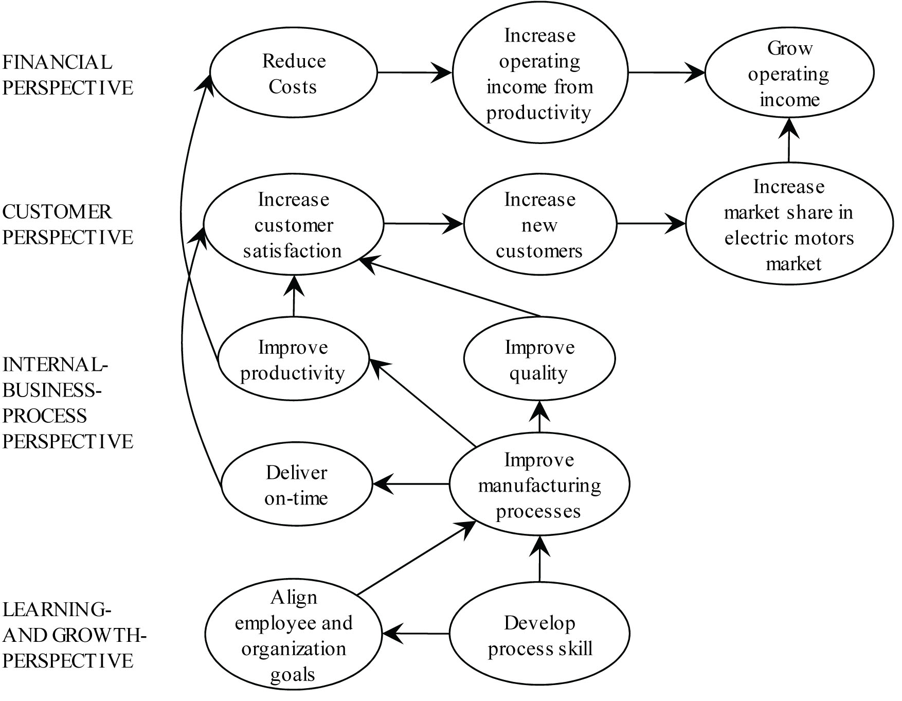

**CHAPTER 12**

**STRATEGY, BALANCED SCORECARD, AND**

**STRATEGIC PROFITABILITY ANALYSIS**

**12-1** Strategy specifies how an organization matches its own capabilities with the opportunities in the marketplace to accomplish its objectives.

**12-2** The five key forces to consider in industry analysis are: (1) competitors, (2) potential entrants into the market, (3) equivalent products, (4) bargaining power of customers, and (5) bargaining power of input suppliers.

**12-3** Two generic strategies are (1) product differentiation, an organization’s ability to offer products or services perceived by its customers to be superior and unique relative to the products or services of its competitors, and (2) cost leadership, an organization’s ability to achieve lower costs relative to competitors through productivity and efficiency improvements, elimination of waste, and tight cost control.

**12-4** A customer preference map describes how different competitors perform across various product attributes desired by customers, such as price, quality, customer service, and product features.

**12-5** Reengineering is the fundamental rethinking and redesign of business processes to achieve improvements in critical measures of performance such as cost, quality, service, speed, and customer satisfaction.

**12-6** The four key perspectives in the balanced scorecard are (1) Financial perspective—this perspective evaluates the profitability of the strategy and the creation of shareholder value; (2) Customer perspective—this perspective identifies the targeted customer and market segments and measures the company’s success in these segments; (3) Internal business process perspective—this perspective focuses on internal operations that further both the customer perspective by creating value for customers and the financial perspective by increasing shareholder value; and (4) Learning and growth perspective—this perspective identifies the capabilities at which the organization must excel to achieve superior internal processes that create value for customers and shareholders.

**12-7** A strategy map is a diagram that describes how an organization creates value by connecting strategic objectives in explicit cause-and-effect relationships with each other in the financial, customer, internal business process, and learning and growth perspectives.

**12-8** A good balanced scorecard design has several features:

1. It tells the story of a company’s strategy by articulating a sequence of cause-and-effect relationships.

2. It helps to communicate the strategy to all members of the organization by translating the strategy into a coherent and linked set of understandable and measurable operational targets.

3. It places strong emphasis on financial objectives and measures in for-profit companies. Nonfinancial measures are regarded as part of a program to achieve future financial performance.

4. It limits the number of measures to only those that are critical to the implementation of strategy.

5. It highlights suboptimal trade-offs that managers may make when they fail to consider operational and financial measures together.

**12-9** Pitfalls to avoid when implementing a balanced scorecard are the following:

1. Don’t assume the cause-and-effect linkages are precise; they are merely hypotheses. An organization must gather evidence of these linkages over time.

2. Don’t seek improvements across all of the measures all of the time.

3. Don’t use only objective measures in the balanced scorecard.

4. Don’t fail to consider both costs and benefits of different initiatives before including these initiatives in the balanced scorecard.

5. Don’t ignore nonfinancial measures when evaluating managers and employees.

**12-10** Three key components in doing a strategic analysis of operating income are the following:

1. The growth component, which measures the change in operating income attributable solely to the change in quantity of output sold from one year to the next.

2. The price-recovery component, which measures the change in operating income attributable solely to changes in the prices of inputs and outputs from one year to the next.

3. The productivity component, which measures the change in costs attributable to a change in the quantity and mix of inputs used in the current year relative to the quantity and mix of inputs that would have been used in the previous year to produce current year output.

**12-11** An analyst can incorporate other factors such as the growth in the overall market and reductions in selling prices resulting from productivity gains into a strategic analysis of operating income. By doing so, the analyst can attribute the sources of operating income changes to particular factors of interests. For example, the analyst will combine the operating income effects of strategic price reductions and any resulting growth with the productivity component to evaluate a company’s cost leadership strategy.

**12-12** Engineered costs result from a cause-and-effect relationship between the cost driver, output, and the (direct or indirect) resources used to produce that output. Discretionary costs arise from periodic (usually annual) decisions regarding the maximum amount to be incurred. They have no measurable cause-and-effect relationship between output and resources used.

**12-13** Downsizing (also called rightsizing) is an integrated approach configuring processes, products, and people to match costs to the activities that need to be performed to operate effectively and efficiently in the present and future. Downsizing is an attempt to eliminate unused capacity.

**12-14** A partial productivity measure is the quantity of output produced divided by the quantity of an individual input used (e.g., direct materials or direct manufacturing labor).

**12-15** No. Total factor productivity (TFP) and partial productivity measures work best together because the strengths of one offset weaknesses in the other. TFP measures are comprehensive, consider all inputs together, and explicitly consider economic substitution among inputs. Physical partial productivity measures are easier to calculate and understand and, as in the case of labor productivity, relate directly to employees’ tasks. Partial productivity measures are also easier to compare across different plants and different time periods.

**12-16** (15 min.) **Balanced scorecard.**

1. Ridgecrest’s 2013 strategy is a cost leadership strategy. Ridgecrest plans to grow by producing high-quality boxes at a low cost delivered to customers at a low price and in a timely manner. Ridgecrest’s boxes are not differentiated, and there are many other manufacturers who produce similar boxes. To succeed, Ridgecrest must produce high-quality boxes at lower costs relative to competitors through productivity and efficiency improvements.

2. Solution Exhibit 12-16A shows the customer preference map for electric motors for Ridgecrest and Kearney on price, timeliness, quality, and design.

**Solution Exhibit 12-16A**

Customer Preference Map for Electric Motors

3. Solution Exhibit 12-16B presents the strategy map for Ridgecrest for 2013.

**Solution Exhibit 12-16B**

Strategy Map for Ridgecrest for 2013

4. Measures that we would expect to see on a Ridgecrest’s balanced scorecard for 2013 are

*Financial Perspective*

(1) Operating income from productivity gain, (2) operating income from growth, (3) cost reductions in key areas.

These measures evaluate whether Ridgecrest has successfully reduced costs and generated growth through cost leadership.

*Customer Perspective*

1.  Market share in electric motors market, (2) number of new customers, (3) customer satisfaction index. The logic is that improvements in these customer measures are leading indicators of whether Ridgecrest’s cost leadership strategy is succeeding with its customers and helping it to achieve superior financial performance.

2.  

*Internal Business Process Perspective*

(1) Productivity, (2) order delivery time, (3) on-time delivery, (4) number of major process improvements.

Improvements in these measures are key drivers of achieving cost leadership and are expected to lead to more satisfied customers and in turn to superior financial performance

*Learning and Growth Perspective*

(1) Percentage of employees trained in process and quality management, (2) employee satisfaction ratings.

Improvements in these measures aim to improve Ridgecrest’s ability to achieve cost leadership and have a cause-and-effect relationship with improvements in internal business processes, which in turn lead to customer satisfaction and financial performance.

**12-17** (20 min.) **Analysis of growth, price-recovery, and productivity components (continuation of 12-16).**

1. Ridgecrest’s operating income gain is consistent with the cost leadership strategy identified in requirement 1 of Exercise 12-16. The increase in operating income in 2013 was driven by the $160,000 gain in productivity in 2013. Ridgecrest took advantage of its productivity gain to reduce the prices of its motors and to fuel growth. It increased market share by growing even though the total market size was unchanged.

2. The productivity component measures the change in costs attributable to a change in the quantity and mix of inputs used in a year relative to the quantity and mix of inputs that would have been used in a previous year to produce the current year output. It measures the amount by which operating income increases and costs decrease through the productive use of input quantities. When comparing productivities across years, the productivity calculations use current year input prices in all calculations. Hence, the productivity component is unaffected by input price changes.

The productivity component represents savings in both variable costs and fixed costs. With respect to variable costs, such as direct materials, productivity improvements immediately translate into cost savings. In the case of fixed costs, such as fixed manufacturing conversion costs, productivity gains result only if management takes actions to reduce unused capacity. For example, reengineering manufacturing processes will decrease the capacity needed to produce a given level of output, but it will lead to a productivity gain only if management reduces the unused capacity by, say, selling off the excess capacity.

**
12-18** (20 min.) **Strategy, balanced scorecard, merchandising operation.**

**(Please alert students that in some printed versions of the book there is a typographical error in line 8 of the table. It should read “Administrative cost per customer (Row 7 ÷ Row 6)” and not “(Row 8 ÷ Row 7).”**

1. Ramiro & Sons follows a product differentiation strategy. Ramiro’s designs are “trendsetting,” its T-shirts are distinctive, and it aims to make its T-shirts a “must have” for each and every teenager. These are all clear signs of a product differentiation strategy, and to succeed, Ramiro must continue to innovate and be able to charge a premium price for its product.

2. Possible key elements of Ramiro’s balance scorecard, given its product differentiation strategy:

*Financial Perspective*

(1) Increase in operating income from charging higher margins, (2) price premium earned on products

These measures will indicate whether Ramiro has been able to charge premium prices and achieve operating income increases through product differentiation.

*Customer Perspective*

(1) Market share in distinctive, name-brand T-shirts, (2) customer satisfaction, (3) new customers, (4) number of mentions of Ramiro’s T-shirts in the leading fashion magazines

Ramiro’s strategy should result in improvements in these customer measures that help evaluate whether Ramiro’s product differentiation strategy is succeeding with its customers. These measures are, in turn, leading indicators of superior financial performance.

*Internal Business Process Perspective*

(1) Quality of silk-screening (number of colors, use of glitter, durability of the design), (2) frequency of new designs, (3) time between concept and delivery of design

Improvements in these measures are expected to result in more distinctive and trendsetting designs delivered to its customers and in turn, superior financial performance.

*Learning and Growth Perspective*

(1) Ability to attract and retain talented designers (2) improvements in silk-screening processes, (3) continuous education and skill levels of marketing and sales staff, (4) employee satisfaction

Improvements in these measures are expected to improve Ramiro’s capabilities to produce distinctive designs that have a cause-and-effect relationship with improvements in internal business processes, which in turn lead to customer satisfaction and financial performance.

**
12-19** (25–30 min.) **Strategic analysis of operating income (continuation of 12-18).**

1. **Operating Income Statement**

|                                               |              |              |
|-----------------------------------------------|--------------|--------------|
|                                               | **2012**     | **2013**     |
| Revenues ($32 205,000; $33 233,000)           | *$6,560,000* | *$7,689,000* |
| Costs                                         |              |              |
| T-shirts purchased ($17 225,500; $15 257,000) | 3,833,500    | 3,855,000    |
| Administrative costs                          | *1,739,000 * | *1,691,000 * |
| Total costs                                   | *5,572,500 * | *5,546,000 * |
| Operating income                              | $ 987,500    | $2,143,000   |
|                                               |              |              |
| Change in operating income                    | $1,155,500 F |

2. **The Growth Component**

= ×

= (233,000 − 205,000) × $32 = $896,000 F

= ×

= ×

Direct materials (purchased T-shirts) that would be required in 2013 to sell 233,000 T‑shirts instead of the 205,000 sold in 2012, assuming the 2012 input-output relationship continued into 2013, equal 256,300 purchased T-shirts . Administrative capacity will not change because adequate capacity exists in 2012 to support year 2013 output and customers.

The cost effects of growth component are

Direct materials costs (256,300 − 225,500) × $17 = $523,600 U

Administrative costs (4,700 – 4,700) × $370 = *0*

Cost effect of growth $523,600 U

In summary, the net increase in operating income as a result of the growth component equals:

Revenue effect of growth $896,000 F

Cost effect of growth *523,600* U

Change in operating income due to growth $372,400 F

**The Price-Recovery Component**

= ($33− $32) × 233,000 = $233,000 F

= ×

= ×

Direct materials costs ($15 − $17) × 256,300 = $512,600 F

Administrative costs ($380 − $370) × 4,700 = *47,000* U

Total cost effect of price-recovery component $465,600 F

In summary, the net increase in operating income as a result of the price-recovery component equals:

> Revenue effect of price-recovery $233,000 F

Cost effect of price-recovery *465,600* F

Change in operating income due to price-recovery $698,600 F

**The Productivity Component **

=

=

The productivity component of cost changes are

Direct materials costs (257,000 − 256,300) × $15 = $10,500U

Administrative costs (4,450 − 4,700) × $380 = *95,000* F

Change in operating income due to productivity $84,500 F

The change in operating income between 2012 and 2013 can be analyzed as follows:

|                  |               |                  |                     |                                 |                           |
|------------------|---------------|------------------|---------------------|---------------------------------|---------------------------|
|                  | **Income**    
                                   
                    **Statement**  
                                   
                    **Amounts**    
                                   
                    **in 2012**    
                                   
                    **(1)**        | **Revenue and**  
                                                      
                                    **Cost Effects**  
                                                      
                                    **of Growth**     
                                                      
                                    **in 2013**       
                                                      
                                    **(2)**           | **Revenue and**     
                                                                            
                                                       **Cost Effects of**  
                                                                            
                                                       **Price-Recovery**   
                                                                            
                                                       **in 2013**          
                                                                            
                                                       **(3)**              | **Cost Effect of Productivity** 
                                                                                                              
                                                                             **in 2013 **                     
                                                                                                              
                                                                             **(4)**                          | **Income**                
                                                                                                                                          
                                                                                                               **Statement**              
                                                                                                                                          
                                                                                                               **Amounts**                
                                                                                                                                          
                                                                                                               **in 2013**                
                                                                                                                                          
                                                                                                               **(5) =**                  
                                                                                                                                          
                                                                                                               **(1) + (2) + (3) + (4)**  |
| Revenues         | $6,560,000    | $896,000 F       | $233,000 F          | −−                              | $7,689,000                |
| Costs            | *5,572,500*   | *523,600* U      | *465,600* F         | *$84,500* F                     | *5,546,000*               |
| Operating income | $ 987,500     | $372,400 F       | $698,600 F          | $84,500 F                       | $2,143,000                |

$1,155,500 F

Change in operating income

3. The analysis of operating income indicates that growth, price-recovery, and productivity all resulted in favorable changes in operating income in 2013. Further, a significant amount of the increase in operating income resulted from Ramiro’s product differentiation strategy. The company was able to continue to charge a premium price while growing sales even as the cost of shirts decreased. It was also able to earn additional operating income by improving its productivity.

**
12-20** (20 min.) **Analysis of growth, price-recovery, and productivity components (continuation of 12-19).**

*Effect of the industry-market-size factor on operating income*

Of the 28,000-unit (233,000 – 205,000) increase in sales between 2012 and 2013, 20,500 (10% × 205,000) units are due to growth in market size, and 7,500 (28,000 – 20,500) units are due to an increase in market share.

The change in Ramiro’s operating income from the industry-market size factor rather than from specific strategic actions is:

$372,400 (the growth component in Exercise 12-19) × $272,650 F

*Effect of product differentiation on operating income*

The change in operating income due to:

Increase in the selling price (revenue effect of price recovery) $233,000 F

Decrease in price of inputs (cost effect of price recovery) 465,600 F

Growth in market share due to product differentiation

$372,400 (the growth component in Exercise 12-19) × *99,750* F

Change in operating income due to product differentiation $798,350 F

*Effect of cost leadership on operating income*

The change in operating income from cost leadership is:

Productivity component $ 84,500 F

The change in operating income between 2012 and 2013 can be summarized as follows:

Change due to industry-market-size $ 272,650 F

Change due to product differentiation 798,350 F

Change due to cost leadership *84,500* F

Change in operating income $1,155,500 F

Ramiro has been very successful in implementing its product differentiation strategy. Nearly 69% ($798,350 ÷ $1,155,500) of the increase in operating income during 2013 was due to product differentiation, i.e., the distinctiveness of its T-shirts. It was able to raise prices of its products despite a decline in the cost of the T-shirts purchased. Ramiro’s operating income increase in 2013 was also helped by a growth in the overall market and a small productivity improvement, which it did not pass on to its customers in the form of lower prices.

**
12-21** (15 min.) **Identifying and managing unused capacity (continuation of 12‑18).**

1. The amount and cost of unused capacity at the beginning of year 2013 based on year 2013 production follows:

 **Amount of Cost of**
======================

###  Unused Unused

####  Capacity Capacity

Administrative, 4,700 − 4,200; (4,700 – 4,200) × $380 500 $190,000
------------------------------------------------------------------

2. Ramiro can reduce administrative capacity by another 250 customers (4,450 – 250 = 4,200 actual customers). Ramiro will save another 250 × $380 = $95,000. This is the maximum amount of costs Ramiro can save in 2013, in addition to the $95,000 ($380 250 customers) that Ramiro already saved when downsizing from 4,700 customers to 4,450 customers.

3. Before Ramiro downsizes administrative capacity, it should consider whether sales increases in the future would lead to a greater demand for and utilization of capacity as new customers are drawn to Ramiro’s distinctive products—at that point, customer service may be the key to new customer retention and further growth. Also, the market feedback often provided by customer service staff is probably key to Ramiro’s cutting-edge fashion strategy; some of this may be lost if administrative capacity is cut back. In addition, significant reductions in capacity usually mean laying off people, which can hurt employee morale.

**12-22** (15 min.) **Strategy, balanced scorecard.**

1. Stanmore Corporation follows a product differentiation strategy in 2011. Stanmore’s D4H machine is distinct from its competitors and generally regarded as superior to competitors’ products. To succeed, Stanmore must continue to differentiate its product and charge a premium price.

2. Balanced Scorecard measures for 2013 follow:

*Financial Perspective*

(1) Increase in operating income from charging higher margins, (2) price premium earned on products

These measures indicate whether Stanmore has been able to charge premium prices and achieve operating income increases through product differentiation.

*Customer Perspective*

(1) Market share in high-end special-purpose textile machines, (2) customer satisfaction, (3) new customers

Stanmore’s strategy should result in improvements in these customer measures that help evaluate whether Stanmore’s product differentiation strategy is succeeding with its customers. These measures are leading indicators of superior financial performance.

*Internal Business Process Perspective*

(1) Manufacturing quality and reduced wastage of direct materials, (2) new product features added, (3) order delivery time

Improvements in these measures are expected to result in more distinctive products delivered to its customers and in turn superior financial performance.

*Learning and Growth Perspective*

(1) Development time for designing new machines, (2) improvements in manufacturing processes, (3) employee education and skill levels, (4) employee satisfaction

Improvements in these measures are likely to improve Stanmore’s capabilities to produce distinctive products that have a cause-and-effect relationship with improvements in internal business processes, which in turn lead to customer satisfaction and financial performance.

**12-23** (30 min.) **Strategic analysis of operating income (continuation of 12-22)**.

1. Operating income for each year is as follows:

**2012 2013**

Revenue ($40,000 × 200; $42,000 × 210) *$8,000,000* *$8,820,000*

Costs

> Direct materials costs ($8 × 300,000; $8.50 × 310,000) 2,400,000 2,635,000
>
> Manufacturing conversion costs ($8,000 × 250; 8,100 × 250) 2,000,000 2,025,000
>
> Selling & customer service costs ($10,000 × 100; $9,900 × 95) *  1,000,000* *   940,500*
>
> Total costs *5,400,000* *5,600,500*

Operating income $2,600,000 $3,219,500

Change in operating income $619,500 F

2. **The Growth Component**

=

= (210 − 200) × $40,000 = $400,000 F

=

= ×

Kilograms of direct materials that would be required in 2013 to produce 210 units instead of the 200 units produced in 2012, assuming the 2012 input-output relationship continued into 2013, equal 315,000 kilograms . Manufacturing conversion costs and selling and customer-service capacity will not change because adequate capacity exists in 2012 to support year 2013 output and customers.

The cost effects of growth component are:

Direct materials costs (315,000 − 300,000) × $8 = $120,000 U

Manufacturing conversion costs (250 − 250) × $8,000 = 0

Selling & customer-service costs (100 − 100) × $25,000 = *0*

Cost effect of growth $120,000 U

In summary, the net increase in operating income as a result of the growth component equals:

Revenue effect of growth $400,000 F

Cost effect of growth *120,000* U

Change in operating income due to growth $280,000 F

**The Price-Recovery Component**

= ($42,000 − $40,000) × 210 = $420,000 F

= ×

= ×

Direct materials costs ($8.50 − $8) × 315,000 = $157,500 U

Manufacturing conversion costs ($8,100 − $8,000) × 250 = 25,000 U

Selling & customer-service costs ($9,900 − $10,000) × 100 = *10,000* F

Cost effect of price-recovery $172,500 U

> Revenue effect of price-recovery $420,000 F

Cost effect of price-recovery *172,500* U

Change in operating income due to price-recovery $247,500 F

**The Productivity Component **

=

=

The productivity component of cost changes are

Direct materials costs (310,000 − 315,000) × $8.50 = $42,500 F

Manufacturing conversion costs (250 − 250) × $8,100 = 0

Selling & customer-service costs (95 − 100) × $9,900 = *49,500* F

Change in operating income due to productivity $92,000 F

The change in operating income between 2012 and 2013 can be analyzed as follows:

|                  |               |                  |                     |                                 |                         |
|------------------|---------------|------------------|---------------------|---------------------------------|-------------------------|
|                  | **Income**    
                                   
                    **Statement**  
                                   
                    **Amounts**    
                                   
                    **in 2012**    
                                   
                    **(1)**        | **Revenue and**  
                                                      
                                    **Cost Effects**  
                                                      
                                    **of Growth**     
                                                      
                                    **Component**     
                                                      
                                    **in 2013**       
                                                      
                                    **(2)**           | **Revenue and**     
                                                                            
                                                       **Cost Effects of**  
                                                                            
                                                       **Price-Recovery**   
                                                                            
                                                       **Component**        
                                                                            
                                                       **in 2013**          
                                                                            
                                                       **(3)**              | **Cost Effect of Productivity** 
                                                                                                              
                                                                             **Component**                    
                                                                                                              
                                                                             **in 2013 **                     
                                                                                                              
                                                                             **(4)**                          | **Income**              
                                                                                                                                        
                                                                                                               **Statement**            
                                                                                                                                        
                                                                                                               **Amounts in 2013**      
                                                                                                                                        
                                                                                                               **(5) =                  
                                                                                                               (1) + (2) + (3) + (4)**  |
| Revenues         | $8,000,000    | $400,000 F       | $420,000 F          | −−                              | $8,820,000              |
| Costs            | *5,400,000*   | *120,000* U      | *172,500* U         | *$92,000* F                     | *5,600,500*             |
| Operating income | $2,600,000    | $280,000 F       | $247,500 F          | $92,000 F                       | $3,219,500              |

$619,500 F

Change in operating income

3. The analysis of operating income indicates that a significant amount of the increase in operating income resulted from Stanmore’s product differentiation strategy. The company was able to continue to charge a premium price while growing sales. Stanmore was also able to earn additional operating income by improving its productivity. The productivity gains may be important from the standpoint of funding the product differentiation strategy and innovation (as has been the case with the pharmaceutical industry in recent years), but Stanmore’s strategic focus has to be on differentiating its products.

**12-24** (20 min.) **Analysis of growth, price-recovery, and productivity components** **(continuation of 12-23).**

*Effect of the industry-market-size factor on operating income*

Of the 10-unit increase in sales from 200 to 210 units, 3% or 6 (3% × 200) units is due to growth in market size, and 4 (10 − 6) units is due to an increase in market share.

The change in Stanmore’s operating income from the industry-market size factor rather than from specific strategic actions is:

$280,000 (the growth component in Exercise 12-23) × $168,000 F

*Effect of product differentiation on operating income*

The change in operating income due to:

Increase in the selling price of D4H (revenue effect of price recovery) $420,000 F

Increase in price of inputs (cost effect of price recovery) 172,500 U

Growth in market share due to product differentiation

$280,000 (the growth component in Exercise 12-23) × *112,000* F

Change in operating income due to product differentiation $359,500 F

*Effect of cost leadership on operating income*

The change in operating income from cost leadership is:

Productivity component $ 92,000 F

The change in operating income between 2012 and 2013 can be summarized as follows:

Change due to industry-market-size $168,000 F

Change due to product differentiation 359,500 F

Change due to cost leadership *92,000* F

Change in operating income $619,500 F

Stanmore has been successful in implementing its product differentiation strategy. More than 58% ($359,500 ÷ $619,500) of the increase in operating income during 2013 was due to product differentiation, i.e., the distinctiveness of its machines. It was able to raise the prices of its machines faster than the costs of its inputs and still grow market share. Stanmore’s operating income increase in 2013 was also helped by a growth in the overall market and some productivity improvements.

**12-25** (15 min.) **Identifying and managing unused capacity (continuation of 12‑22).**

1. The amount and cost of unused capacity at the beginning of year 2013 based on year 2013 production follows:

 **Amount of Cost of**
======================

###  Unused Unused

####  Capacity Capacity

Manufacturing, 250 − 210; (250 – 210) × $8,100 40 $324,000
----------------------------------------------------------

##### Selling and customer service, 100 – 80; (100 – 80) × $9,900 20 198,000

2. Stanmore can reduce manufacturing capacity from 250 units to 220 (250 − 30) units. Stanmore will save 30 × $8,100 = $243,000. This is the maximum amount of costs Stanmore can save in 2013. It cannot reduce capacity further (by another 30 units to 190 units) because it would then not have enough capacity to manufacture 210 units in 2013 (units that contribute significantly to operating income).

3. Stanmore may choose not to downsize because it projects sales increases that would lead to a greater demand for and utilization of capacity. Stanmore may have also decided not to downsize because downsizing requires a significant reduction in capacity. For example, Stanmore may have chosen to downsize some more manufacturing capacity if it could do so in increments of say, 10, rather than 30 units. Also, Stanmore may be focused on product differentiation, which is key to its strategy, rather than on cost reduction. Not reducing significant capacity also helps to boost and maintain employee morale.

**
12-26** (15 min.) **Strategy, balanced scorecard, service company.**

1. Southland Corporation’s strategy in 2013 is cost leadership. Southland’s consulting services for implementing sales management software is not distinct from its competitors. The market for these services is very competitive. To succeed, Southland must deliver quality service at low cost while improving productivity.

2. Balanced Scorecard measures for 2013 follow:

*Financial Perspective*

(1) Increase operating income from productivity gains and growth, (2) revenues per employee, (3) cost reductions in key areas, for example, software implementation and overhead costs

These measures indicate whether Southland has been able to reduce costs and achieve operating income increases through cost leadership.

*Customer Perspective*

(1) Market share, (2) new customers, (3) customer responsiveness, (4) customer satisfaction

Southland’s strategy should result in improvements in these customer measures that help evaluate whether Southland’s cost leadership strategy is succeeding with its customers. These measures are leading indicators of superior financial performance.

*Internal Business Process Perspective*

(1) Time to complete customer jobs, (2) time lost due to errors, (3) quality of job (Is system running smoothly after job is completed?)

Improvements in these measures are key drivers of achieving cost leadership and are expected to lead to more satisfied customers, lower costs, and superior financial performance.

*Learning and Growth Perspective*

(1) Time required to analyze and design implementation steps, (2) time taken to perform key steps implementing the software, (3) skill levels of employees, (4) hours of employee training, (5) employee satisfaction and motivation

Improvements in these measures are likely to improve Southland’s ability to achieve cost leadership and have a cause-and-effect relationship with improvements in internal business processes, customer satisfaction, and financial performance.

**
12-27** (30 min.) **Strategic analysis of operating income (continuation of 12-26).**

1. Operating income for each year is as follows:

**2012 2013**

Revenues ($45,000 × 40; $42,000 × 55) *$1,800,000* *$2,310,000*

Costs

> Software implementation labor costs
>
> ($58 × 25,000; $60 × 28,000) 1,450,000 1,680,000
>
> Software implementation support costs
>
> ($3,200 × 70; $3,600 × 70) *224,000* *252,000*
>
> Total costs *  1,674,000* *1,932,000*

Operating income $ 126,000 $ 378,000

Change in operating income $252,000 F

1.  **The Growth Component**

=

> = (55 – 40) × $45,000 = $675,000

=

= ×

Software implementation labor-hours that would be required in 2013 to produce 55 units instead of the 40 units produced in 2012, assuming the 2012 input-output relationship continued into 2013, equal 34,375  labor-hours. Software implementation support capacity would not change since adequate capacity exists in 2012 to support year 2013 output and customers.

The cost effects of growth component are

Software implementation labor costs (34,375 – 25,000) × $58 = $543,750 U

Software implementation support costs (70 – 70) × $3,200 = *0*

Cost effect of growth $543,750 U

In summary, the net increase in operating income as a result of the growth component equals:

> Revenue effect of growth $675,000 F
>
> Cost effect of growth *543,750* U
>
> Change in operating income due to growth $131,250 F

**The Price-Recovery Component**

> = ($42,000 – $45,000) × 55 = $165,000 U

= ×

= ×

Software implementation labor costs ($60 – $58) × 34,375 = $68,750 U

Software implementation support costs ($3,600 – $3,200) × 70 = *28,000* U

Cost effect of price recovery $96,750 U

In summary, the net decrease in operating income as a result of the price-recovery component equals:

> Revenue effect of price-recovery $165,000 U
>
> Cost effect of price-recovery *   96,750* U
>
> Change in operating income due to price recovery $261,750 U

**
The Productivity Component**

=

=

The productivity component of cost changes are:

Software implementation labor costs (28,000 – 34,375) × $60 = $382,500 F

Software implementation support costs (70 – 70) × $3,600 = *0*

Change in operating income due to productivity $382,500 F

The change in operating income between 2012 and 2013 can be analyzed as follows:

|                  |               |                  |                     |                                 |                           |
|------------------|---------------|------------------|---------------------|---------------------------------|---------------------------|
|                  | **Income**    
                                   
                    **Statement**  
                                   
                    **Amounts**    
                                   
                    **in 2012**    
                                   
                    **(1)**        | **Revenue and**  
                                                      
                                    **Cost Effects**  
                                                      
                                    **of Growth**     
                                                      
                                    **Component**     
                                                      
                                    **in 2013**       
                                                      
                                    **(2)**           | **Revenue and**     
                                                                            
                                                       **Cost Effects of**  
                                                                            
                                                       **Price-Recovery**   
                                                                            
                                                       **Component**        
                                                                            
                                                       **in 2013**          
                                                                            
                                                       **(3)**              | **Cost Effect of Productivity** 
                                                                                                              
                                                                             **Component**                    
                                                                                                              
                                                                             **in 2013 **                     
                                                                                                              
                                                                             **(4)**                          | **Income**                
                                                                                                                                          
                                                                                                               **Statement**              
                                                                                                                                          
                                                                                                               **Amounts**                
                                                                                                                                          
                                                                                                               **in 2013**                
                                                                                                                                          
                                                                                                               **(5) =**                  
                                                                                                                                          
                                                                                                               **(1) + (2) + (3) + (4)**  |
| Revenues         | $1,800,000    | $675,000 F       | $165,000 U          | −−                              | $2,310,000                |
| Costs            | *1,674,000*   | *543,750* U      | *96,750* U          | *$382,500* F                    | *1,932,000*               |
| Operating income | $ 126,000     | $131,250 F       | $261,750 U          | $382,500 F                      | $ 378,000                 |

$252,000 F

Change in operating income

3. The analysis of operating income indicates that a significant amount of the increase in operating income resulted from Southland’s productivity improvements in 2013. The company had to reduce selling prices while labor costs were increasing but it was able to increase operating income by improving its productivity. The productivity gains also allowed Southland to be competitive and grow the business. The unfavorable price recovery component indicates that Southland could not pass on increases in labor-related wages via price increases to its customers, very likely because its product was not differentiated from competitors’ offerings.

**
12-28** (25 min.) **Analysis of growth, price-recovery, and productivity components (continuation of 12-27).**

*Effect of industry-market-size factor on operating income*

Of the 15-unit increase in sales from 40 to 55 units, 10% or 4 units (10% × 40) are due to growth in market size, and 11 (15 − 4) units are due to an increase in market share.

The change in Southland’s operating income from the industry market-size factor rather than from specific strategic actions is:

$131,250 (the growth component in Exercise 12-27) × $ 35,000 F

*Effect of product differentiation on operating income*

Increase in prices of inputs (cost effect of price recovery) $ 96,750 U

*Effect of cost leadership on operating income*

Productivity component $382,500 F

Effect of strategic decision to reduce selling price, $3,000 × 55 165,000 U

Growth in market share due to productivity improvement

and strategic decision to reduce selling price

$131,250 (the growth component in Exercise 12-27) × *96,250* F

Change in operating income due to cost leadership $313,750 F

The change in operating income between 2012 and 2013 can then be summarized as

Change due to industry-market-size $ 35,000 F

Change due to product differentiation 96,750 U

Change due to cost leadership *313,750* F

Change in operating income $252,000 F

Southland has been very successful in implementing its cost leadership strategy. Despite the increase in the cost of software-implementation labor and software-implementation support, Southland strategically decreased the selling price of a job by $2,000. That is, Southland took advantage of its productivity gains to reduce price, gain market share, and increase operating income.

**12-29** (20 min.) **Identifying and managing unused capacity (continuation of 12-26).**

1. The amount and cost of unused capacity at the beginning of year 2013 when Southland makes its capacity decisions for the year based on work done in year 2013 follows:

**Amount of Cost of**

**Unused Unused**

**Capacity Capacity**

Software implementation support, (70 − 55); (70 − 55) × $3,600 15 $54,000

2. Southland can reduce software implementation support capacity from 70 jobs to 60 (70 − 10) jobs. Southland will save 10 × $3,600 = $36,000. This is the maximum amount of costs Southland can save by downsizing in 2013. It cannot reduce capacity further (by another 10 jobs to 50 jobs) because it would then not have enough capacity to do 55 jobs in 2012 (jobs that contribute significantly to operating income).

3. Southland may have chosen not to downsize because it projects sales increases in the near term that would lead to greater demand for and utilization of capacity. Southland may have also decided not to downsize because downsizing requires a significant reduction in capacity. For example, Southland may have chosen to downsize additional software implementation support capacity if it could do so in, say, increments of 5, rather than 10 units. Not reducing significant capacity by laying off employees boosts employee morale and keeps employees more motivated and productive.

**12-30** (20–25 min.) **Balanced scorecard and strategy.**

1. Solution Exhibit 12-30A shows the customer preference map for DVD players for Scott Company and Nomad Manufacturing on price, playback features, and quality.

**Solution Exhibit 12-30A**

Customer Preference Map for DVD Players

2. Scott currently follows a cost leadership strategy, which is reflected in its lower price compared to Nomad Manufacturing. The Maxus DVD player is similar to products offered by competitors.

3. Solution Exhibit 12-30B presents Scott’s strategy map explaining cause-and-effect relation-ships in its balanced scorecard.

**Solution Exhibit 12-30B**

Strategy Map for Scott Company

In the learning and growth perspective, Scott measures the percentage of employees trained in quality management and the percentage of manufacturing processes with real-time feedback. These objectives improve manufacturing processes and quality in the internal-business process perspective. Improvements in these measures increase customer satisfaction and market shares, which in turn increase revenues and operating income. To see if the increases in operating income are coming from productivity improvements, Scott measures the changes in operating income specifically attributable to productivity and quality improvements.

4. To achieve its goals, Scott could include the following measures under each perspective of the balanced scorecard related to its strategy map:

| Financial Perspective                 | Operating income from productivity and quality improvement    
                                                                                                        
                                         Operating income from growth                                   
                                                                                                        
                                         Revenue growth                                                 |
|---------------------------------------|---------------------------------------------------------------|
|                                       |                                                               |
| Customer Perspective                  | Market share                                                  
                                                                                                        
                                         Number of additional customers                                 
                                                                                                        
                                         Customer-satisfaction ratings                                  |
|                                       |                                                               |
| Internal-Business-Process Perspective | Percentage of defective products sold                         
                                                                                                        
                                         Number of major improvements in manufacturing process          |
|                                       |                                                               |
| Learning-and-Growth Perspective       | Employee-satisfaction ratings                                 
                                                                                                        
                                         Percentage of employees trained in quality management          
                                                                                                        
                                         Percentage of line workers empowered to manage processes       
                                                                                                        
                                         Percentage of manufacturing processes with real-time feedback  |

**12-31** (25–30 min.) **Strategic analysis of operating income (continuation of 12-30).**

1. Operating income for each year is as follows:

**2011 2012**

Revenue ($95 × 8,000; $80 × 11,000) *$760,000* *$880,000*

Costs

> Direct materials costs ($32 × 10,000; $32 × 11,000) 320,000 352,000
>
> Conversion costs 280,000 260,000
>
> Selling & customer service costs *13,500* *    16,200*
>
> Total costs *613,500* *  628,200*

Operating income $146,500 $251,800

Change in operating income $105,300 F

2. **The Growth Component**

=

= (11,000 − 8,000) × $95 = $285,000 F

=

= ×

Direct materials that would be required in 2013 to produce 11,000 units instead of the 8,000 units produced in 2012, assuming the 2012 input-output relationship continued into 2013, equal 13,750 kits . That is, the number of kits to produce 11,000 units is

10,000 kits ÷ 8,000 units = 1.25 kits per unit × 11,000 units = 13,750 kits. Conversion costs and selling and customer-service capacity will not change because adequate capacity exists in 2012 to support year 2013 output and customers.

The cost effects of growth component are:

Direct materials costs (13,750 − 10,000) × $ 32 = $120,000 U

Conversion costs (14,000 − 14,000) × $ 20 = 0

Selling & customer-service costs (90 − 90) × $ 150 = *0*

Cost effect of growth $120,000 U

In summary, the net increase in operating income as a result of the growth component equals:

Revenue effect of growth $285,000 F

Cost effect of growth *120,000* U

Change in operating income due to growth $165,000 F

**The Price-Recovery Component**

= ($80 − $95) × 11,000 = $165,000 U

= ×

= ×

Direct materials costs ($32 – $32) × 13,750 = $ 0

Conversion costs ($20 − $20) × 12,000 = 0

Selling & customer-service costs ($180 − $150) × 90 = *2,700* U

Cost effect of price-recovery $2,700 U

In summary, the net increase in operating income as a result of the price-recovery component equals:

> Revenue effect of price-recovery $165,000 U
>
> Cost effect of price-recovery *      2,700* U

Change in operating income due to price-recovery $167,700 U

**The Productivity Component **

=

=

The productivity component of cost changes are

Direct materials costs (11,000 − 13,750) × $32 = $ 88,000 F

Conversion costs (13,000 – 14,000) × $20 = 20,000 F

Selling & customer-service costs (90 − 90) × $180 = *0*

Change in operating income due to productivity $108,000 F

The change in operating income between 2012 and 2013 can be analyzed as follows:

|                  |               |                  |                     |                                 |                           |
|------------------|---------------|------------------|---------------------|---------------------------------|---------------------------|
|                  | **Income**    
                                   
                    **Statement**  
                                   
                    **Amounts**    
                                   
                    **in 2012**    
                                   
                    **(1)**        | **Revenue and**  
                                                      
                                    **Cost Effects**  
                                                      
                                    **of Growth**     
                                                      
                                    **Component**     
                                                      
                                    **in 2013**       
                                                      
                                    **(2)**           | **Revenue and**     
                                                                            
                                                       **Cost Effects of**  
                                                                            
                                                       **Price-Recovery**   
                                                                            
                                                       **Component**        
                                                                            
                                                       **in 2013**          
                                                                            
                                                       **(3)**              | **Cost Effect of Productivity** 
                                                                                                              
                                                                             **Component**                    
                                                                                                              
                                                                             **in 2013 **                     
                                                                                                              
                                                                             **(4)**                          | **Income**                
                                                                                                                                          
                                                                                                               **Statement**              
                                                                                                                                          
                                                                                                               **Amounts**                
                                                                                                                                          
                                                                                                               **in 2013**                
                                                                                                                                          
                                                                                                               **(5) =**                  
                                                                                                                                          
                                                                                                               **(1) + (2) + (3) + (4)**  |
| Revenues         | $760,000      | $285,000 F       | $165,000 U          | −−                              | $880,000                  |
| Costs            | *613,500*     | *120,000* U      | *2,700* U           | *$108,000* F                    | *628,200*                 |
| Operating income | $146,500      | $165,000 F       | $167,700 U          | $108,000 F                      | $251,800                  |

$105,300 F

Change in operating income

3. The analysis of operating income indicates that a significant amount of the increase in operating income resulted from Scott’s cost leadership strategy. The company was able to improve quality and grow sales. The price recovery component indicates that Scott reduced prices to be competitive in the market, but Scott also improved direct material productivity and reduced conversion cost capacity as rework decreased. Lower prices and higher quality boosted sales.

.

**12-32** (20 min.) **Analysis of growth, price-recovery, and productivity components (continuation of 12-31). **

*Effect of the industry-market-size factor on operating income*

Of the 3,000-unit increase in sales from 8,000 to 11,000 units, 10% or 800 (10% × 8,000) units are due to growth in market size, and 2,2000 (3,000 − 800) units are due to an increase in market share.

The change in Scott’s operating income from the industry-market size factor rather than from specific strategic actions is:

$165,000 (the growth component in Exercise 12-31) × $ 44,000 F

*Effect of product differentiation on operating income*

The change in operating income due to:

Increase in price of inputs (cost effect of price recovery) $ 2,700 U

*Effect of cost leadership on operating income*

The change in operating income from cost leadership is:

Productivity component $108,000 F

Decrease in selling price (revenue effect of price recovery) 165,000 U

Growth in market share due to cost leadership

$165,000 (the growth component in Exercise 12-31) × 121,000 F

Change in operating income due to cost leadership $ 64,000 F

The change in operating income between 2012 and 2013 can be summarized as follows:

Change due to industry market-size $44,000 F

Change due to product differentiation 2,700 U

Change due to cost leadership *64,000* F

Change in operating income $32,000 F

Scott has been successful in implementing its cost leadership strategy. The increase in operating income during 2013 was due to cost leadership through quality improvements and sales growth. It cut its prices significantly to gain market share that might also benefit it in future periods.

Scott’s operating income increase in 2013 was also helped by a growth in the overall market size.

**12-33** (20 min.) **Identifying and managing unused capacity (continuation of 12-31). **

1. The amount and cost of unused capacity at the beginning of year 2012 when Scott makes its capacity decisions for the year based on year 2012 production follows:

|                                                         | **Amount of**  | **Cost of**    |
|---------------------------------------------------------|----------------|----------------|
|                                                         | **Unused**     | **Unused**     |
|                                                         | ***Capacity*** | ***Capacity*** |
| Manufacturing, 14,000 − 11,000; (14,000 – 11,000) × $20 | 3,000          | $60,000        |
| Selling and customer service, 90 – 80; (90– 80) × $180  | 10             | $ 1,800        |

2. Scott can reduce selling and customer-service capacity by another 10 customers (90 – 80 = 10 customers). Scott will save another 10 × $180 = $1,800. This is the maximum amount of costs Scott can save in 2012.

3. Scott may have chosen not to downsize because it projects sales increases in the near term that would lead to greater demand for and utilization of selling and customer-service capacity. It is difficult to reduce and then immediately increase capacity. Not reducing significant capacity by laying off employees boosts employee morale and keeps employees more motivated and productive.

.

**12-34** (20–30 min.) **Balanced scorecard. **

####  Strategic Performance

***Perspectives* *Objectives* *Measures***

▪ Financial ▪ Increase shareholder value ▪ Earnings per share

 ▪ Net income
=============

 ▪ Return on assets 
====================

▪ Return on sales

▪ Return on equity

▪ Product cost per unit

▪ Increase profit generated ▪ Profit per salesperson

by each salesperson

▪ Customer ▪ Acquire new customers ▪ Number of new customers

▪ Retain customers ▪ Percentage of customers retained

▪ Develop profitable customers ▪ Customer profitability

▪ Customer cost per unit

▪ Internal Business ▪ Improve manufacturing ▪ Percentage of defective

Process quality product units

▪ Introduce new products

▪ Minimize invoice error rate ▪ Percentage of error-free invoices

▪ On-time delivery by suppliers ▪ Percentage of on-time deliveries

by suppliers

▪ Increase proprietary products ▪ Number of patents

▪ Learning and ▪ Increase information system ▪ Percentage of processes with

Growth capabilities real-time feedback

▪ Enhance employee skills ▪ Employee turnover rate

▪ Average job-related training

hours per employee

**12-35** (20 min.) **Balanced scorecard.**

1. Petrocal’s strategy is to focus on “service-oriented customers” who are willing to pay a higher price for services. Even though gasoline is largely a commodity product, Petrocal wants to differentiate itself through the service it provides at its retailing stations.

Does the scorecard represent Petrocal’s strategy? By and large it does. The focus of the scorecard is on measures of process improvement, quality, market share, and financial success from product differentiation and charging higher prices for customer service. There are some deficiencies that the subsequent assignment questions raise but, abstracting from these concerns for the moment, the scorecard does focus on implementing a product differentiation strategy.

Having concluded that the scorecard has been reasonably well designed, how has Petrocal performed relative to its strategy in 2013? It appears from the scorecard that Petrocal was successful in implementing its strategy in 2013. It achieved all targets in the financial, internal business, and learning and growth perspectives. The only target it missed was the market
share target in the customer perspective. At this stage, students may raise some questions about whether this is a good scorecard measure. Requirement 3 gets at this issue in more detail. The bottom line is that measuring “market share in the overall gasoline market” rather than in the “service-oriented customer” market segment is not a good scorecard measure, so not achieving this target may not be as big an issue as it may seem at first.

2. Yes, Petrocal should include some measure of employee satisfaction and employee training in the learning and growth perspective. Petrocal’s differentiation strategy and ability to charge a premium price is based on customer service. The key to good, fast, and friendly customer service is well-trained and satisfied employees. Untrained and dissatisfied employees will have poor interactions with customers and cause the strategy to fail. Hence, training and employee satisfaction are very important to Petrocal for implementing its strategy. These measures are leading indicators of whether Petrocal will be able to successfully implement its strategy and should be measured on the balanced scorecard.

3. Petrocal’s strategy is to focus on the 60% of gasoline consumers who are service-oriented, not on the 40% price-shopper segment. To evaluate if it has been successful in implementing its strategy, Petrocal needs to measure its market share in its targeted market segment, “service-oriented customer,” not its market share in the overall market. Given Petrocal’s strategy, it should not be concerned if its market share in the price-shopper segment declines. In fact, charging premium prices will probably cause its market share in this segment to decline. Petrocal should replace “market share in overall gasoline market” with “market share in the service-oriented customer segment” in its balanced scorecard customer measure. Petrocal may also want to consider putting a customer satisfaction measure on the scorecard. This measure should capture an overall evaluation of customer reactions to the facility, the convenience store, employee interactions, and quick turnaround. The customer satisfaction measure would serve as a leading indicator of market share in the service-oriented customer segment.

4. Although there is a cause-and-effect link between internal business process measures and customer measures on the current scorecard, Petrocal should add more measures to tighten this linkage. In particular, the current scorecard measures focus exclusively on refinery operations and not on gas station operations. Petrocal should add measures of gas station performance such as cleanliness of the facility, turnaround time at the gas pumps, the shopping experience at the convenience store, and the service provided by employees. Many companies do random audits of their facilities to evaluate how well their branches and retail outlets are performing. These measures would serve as leading indicators of customer satisfaction and market share in Petrocal’s targeted segments.

5. Petrocal is correct in not measuring changes in operating income from productivity improvements on its scorecard under the financial perspective. Petrocal’s strategy is to grow by charging premium prices for customer service. The scorecard measures focus on Petrocal’s success in implementing this strategy. Productivity gains per se are not critical to Petrocal’s strategy and, therefore, should not be measured on the scorecard.

**
12-36** (30 min.) **Balanced scorecard**.

1. The market for color laser printers is competitive. Vic’s strategy is to produce and sell high-quality laser printers at a low cost. The key to achieving higher quality is reducing defects in its manufacturing operations. The key to managing costs is dealing with the high fixed costs of Vic’s automated manufacturing facility. To reduce costs per unit, Vic would have to either produce more units or eliminate excess capacity.

The scorecard correctly measures and evaluates Vic’s broad strategy of growth through productivity gains and cost leadership. There are some deficiencies, of course, that subsequent assignment questions will consider.

It appears from the scorecard that Vic was not successful in implementing its strategy in 2013. Although it achieved targeted performance in the learning and growth and internal business process perspectives, it significantly missed its targets in the customer and financial perspectives. Vic has not had the success it targeted in the market and has not been able to reduce fixed costs.

2. Vic’s scorecard does not provide any explanation of why the target market share was not met in 2013. Was it due to poor quality? Higher prices? Poor post-sales service? Inadequate supply of products? Poor distribution? Aggressive competitors? The scorecard is not helpful for understanding the reasons underlying the poor market share.

Vic may want to include some measures in the customer perspective (and internal business process perspective) that get at these issues. These measures would then serve as leading indicators (based on cause-and-effect relationships) for lower market share. For example, Vic should measure customer satisfaction with its printers on various dimensions of product features, quality, price, service, and availability. It should measure how well its printers match up against other color laser printers on the market. This is critical information for Vic to successfully implement its strategy.

3. Vic should include a measure of employee satisfaction to the learning and growth perspective and a measure of new product development to the internal business process perspective. The focus of its current scorecard measures is on processes and not on people and products.

Vic considers training and empowering workers as important for implementing its high-quality, low-cost strategy. Therefore employee training and employee satisfaction should appear in the learning and growth perspective of the scorecard. Vic can then evaluate if improving employee-related measures results in improved internal-business process measures, market share and financial performance.

Adding new product development measures to internal business processes is also important. As Vic reduces defects, Vic’s costs will not automatically decrease because many of Vic’s costs are fixed. Instead, Vic will have more capacity available to it. The key question is how Vic will obtain value from this capacity. One important way is to use the capacity to produce and sell new models of its products. Of course if this strategy is to work, Vic must develop new products at the same time that it is improving quality. Hence, the scorecard should contain some measure to monitor progress in new product development. Improving quality without developing and selling new products (or downsizing) will result in weak financial performance. The new product development need not focus on designing innovative products that can command a price premium because Vic’s strategy is one of cost leadership and not product differentiation but rather on product extensions that could help it grow sales.

4. Improving quality and significantly downsizing to eliminate unused capacity is difficult. Recall that the key to improving quality at Vic Corporation is training and empowering workers. As quality improvements occur, capacity will be freed up, but because costs are fixed, quality improvements will not automatically lead to lower costs. To reduce costs, Vic’s management must take actions such as selling equipment and laying off employees. But how can management lay off the very employees whose hard work and skills led to improved quality? If it did lay off employees now, will the remaining employees ever work hard to improve quality in the future? For these reasons, Vic’s management should first focus on using the newly available capacity to sell more products. If it cannot do so and must downsize, management should try to downsize in a way that would not hurt employee morale, such as through retirements and voluntary severance.

If it had to downsize, the preferred approach for Vic to follow is to first downsize by laying off employees, assure the remaining employees that there will be no more layoffs, and then seek to improve quality.

**12-37** (25 min.) **Balanced scorecard, environmental and social performance.**

1. Cerebral’s strategy is to focus on “service-oriented customers” who are willing to pay a higher price for services. Even though candy bars are largely a commodity product, Cerebral wants to differentiate itself through the service it provides with its custom labeling and high-quality product.

Does the scorecard represent Cerebral’s strategy? By and large it does. The focus of the scorecard is on measures of process improvement, quality, market share, and financial success from product differentiation and charging higher prices for customer service. There are some deficiencies that the subsequent assignment questions raise, but abstracting from these concerns for the moment, the scorecard does focus on implementing a product differentiation strategy.

Based on the scorecard being reasonably well designed, how has Cerebral performed relative to its strategy in 2013? It appears from the scorecard that Cerebral was successful in implementing its strategy in 2013. It achieved all targets in the financial, internal business, and learning and growth perspectives (other than women and minorities in the workplace). The only target it missed was the market share target in the customer perspective. At this stage, students may raise some questions about whether this is a good scorecard measure. Requirement 3 gets at this issue in more detail. The bottom line is that measuring “market share in the overall candy market” rather than in the “specialty candy” market segment is not a good scorecard measure, so not achieving this target may not be as big a miss as it may seem at first.

2. Yes, Cerebral should include some measure of customer satisfaction in the customer perspective. Cerebral’s differentiation strategy and ability to charge a premium price is based on meeting and/or exceeding customer expectations, especially in the custom design of the labels. Unsatisfied customers will not be loyal or will be unlikely to recommend the company’s product. Hence, customer satisfaction is very important to Cerebral for implementing its strategy. These measures are leading indicators of whether Cerebral will be able to increase its market share in the specialty candy market and should be measured on the balanced scorecard.

3. To evaluate if it has been successful in implementing its strategy, Cerebral needs to measure its market share in its targeted market segment, not its market share in the overall market. Given Cerebral’s strategy, it should not be concerned if its market share in the candy bar segment declines. In fact, charging premium prices will probably cause its market share in this segment to decline. Cerebral should replace “market share in overall candy bar market” with “market share in the specialty food/candy segment” in its balanced scorecard customer measure. If Cerebral is successfully implementing its strategy, its market share in the specialty candy segment should increase.

4. Cerebral is correct in not measuring changes in operating income from productivity improvements on its scorecard under the financial perspective. Cerebral’s strategy is to grow by charging premium prices for customer service. The scorecard measures focus on Cerebral’s success in implementing this strategy. Productivity gains per se are not critical to Cerebral’s strategy and, therefore, should not be measured on the scorecard.

5. Cerebral included social and environmental performance measures in its balanced scorecard because it believes strong environmental and social performance gives it a competitive advantage by (1) attracting and inspiring outstanding employees, (2) enhancing its reputation with socially conscious customers, investors and analysts, and (3) boosting its image with governments and citizens, all of which contribute to long-run financial performance. Cerebral also believes that focusing on environmental and social performance in addition to financial performance helps it to innovate in technologies, processes, products, and business models to reduce the trade-offs between financial and sustainability goals and build transformational leadership and change capabilities to implement these “triple bottom line” strategies.

Following the concept of shared value, Cerebral includes social and environmental measures (together with business goals and measures) in its balanced scorecard to evaluate how well it is doing toward achieving its social and environmental goals. The balanced scorecard indicates that Cerebral’s social and environmental initiatives are having an effect. Cerebral’s increased use of recycled materials as a percentage of total materials used has resulted in attracting customers for whom using recycled materials matters, creating long-term financial benefit. Similarly increasing the number of women and minorities employed will allow Cerebral to target a larger number of talented individuals. Reducing the size of packaging both increases income and reduces waste, achieving both financial and sustainability objectives.

Not all companies believe in implementing sustainability goals, but those that do find the balanced scorecard to be a useful tool to simultaneously implement both financial and sustainability goals.
**12-38** (25 min.) **Balanced Scorecard, social performance.**

1. The market for cable and Internet providers is competitive. Rocky Plain’s strategy follows a cost-leadership strategy—providing quality service at low cost by being efficient, and effective.

The scorecard correctly measures and evaluates Rocky Plain’s strategy of growth through productivity gains and cost leadership. There are, however, some deficiencies that subsequent assignment questions will consider.

It appears from the scorecard that Rocky Plain was not successful in implementing its strategy in 2013. Although it achieved targeted performance in most of the learning and growth and internal business process perspectives, it significantly missed its targets in the customer and financial perspectives. Rocky Plain has not had the success it targeted in the market and has not been able to improve efficiency in order to reduce costs.

Rocky Plain’s scorecard does not provide an explanation of why the target customer satisfaction measure was not met in 2013. Was it due to poor quality? Higher prices? Poor post-sales service? Aggressive competitors? The scorecard is not helpful for understanding the reasons underlying the poor customer satisfaction.

2. Rocky Plain should not include R&D costs in its internal business process perspective. It should not focus on developing innovative services because it is not following a product differentiation strategy. It needs to cut these costs and focus instead on providing customers a quality service at the lowest costs, and faster and more efficient installation, consistent with its low-cost strategy.

1.  There is a cause-and-effect relationship between the installation time per customer and customer satisfaction but not between money spent in R&D and customer satisfaction. As discussed in requirement 2 above, I would drop the R&D measure. I would then add measures for the quality of the installation service to the internal business process perspective. How much time does it take to schedule an appointment after the customer calls? Does the service work flawlessly after it has been installed? Do customers call Rocky Plain to fix problems? How much time is spent on post-installation support? The point is to add more measures to the internal business process perspective so that Rocky Plain can get a better understanding of the reasons underlying increases and decreases in customer satisfaction.

In the customer perspective, I would add measures to track Rocky Plain’s market share in the Denver area. Do increases in customer satisfaction translate into higher market shares? Is Rocky Plain correctly identifying the factors that customers care deeply about and making improvements in those areas faster than its competitors?

Although not required by the question, the instructor could ask the class what else Rocky Plain might want to include in the learning and growth perspective to support the customer and internal business process perspectives. The learning and growth measures would then serve as leading indicators (based on cause-and-effect relationships) for the internal-business processes and customer satisfaction. For example, Rocky Plain could include a measure related to employee satisfaction or retention. For example, higher employee satisfaction would lead to greater ownership of employees in providing a quality service. This is critical for Rocky Plain to successfully implement its strategy.

1.  Rocky Plain included social and environmental performance measures in its balanced scorecard because it believes strong environmental and social performance gives it a competitive advantage by (1) attracting and inspiring outstanding employees, (2) enhancing its reputation with socially conscious customers, investors and analysts, and (3) boosting its image with governments and citizens, all of which contribute to long-run financial performance. Rocky Plain also believes that focusing on environmental and social performance in addition to financial performance helps it to innovate in technologies, processes, products, and business models to reduce the trade-offs between financial and sustainability goals and build transformational leadership and change capabilities to implement these “triple bottom line” strategies.

Following the concept of shared value, Rocky Plain includes social and environmental measures (together with business goals and measures) in its balanced scorecard to evaluate how well it is doing toward achieving its social and environmental goals. The balanced scorecard indicates that Rocky Plain’s social and environmental initiatives are having mixed results. Rocky Plain’s focus on safety certification training aims to decrease workplace injuries and to reduce overall costs. So far, the safety certification goals have not been met and workplace injuries have not been reduced to their target levels. Rocky Plain would need to consider if the safety certification training has been as effective as it was intended. Similarly increasing the number of new programs with community organizations aims to increase the number of new customers acquired as a result of these initiatives and in turn to increase revenue from new customers. Even though the number of new programs started exceeded the target, it did not result in the targeted number of new customers nor the target revenues from new customers. Rocky Plain would need to reevaluate the kinds of new programs it is implementing.

Not all companies believe in implementing sustainability goals, but those that do find the balanced scorecard to be a useful tool to simultaneously implement both financial and sustainability goals.

**12-39** (25 min.) **Balanced Scorecard.**

1. SmoothAir is following a cost-leadership strategy based on low-cost, no frills, and high quality. SmoothAir was successful in meeting its financial targets in 2013, but it did not achieve target performance in the other three perspectives. It was therefore only partially successful in implementing its strategy. The nonfinancial measures are leading indicators of future performance. Not meeting these targets means that SmoothAir may not be able to sustain its performance in future periods. In other words, while SmoothAir was able to achieve its short-term goals, will it be able to achieve its long-term goals? To do so, SmoothAir needs to improve its internal business and learning and growth performance.

2. Normally, the price recovery component indicates that a company has been successful in differentiating its product or service to command a price premium so that the prices of outputs rise faster than the prices of inputs. For SmoothAir, the price recovery component measures the lower input prices resulting from strong negotiations with suppliers while maintaining output prices. The productivity component measures the efficiently use of input quantities and the elimination of certain inflight services. A favorable price recovery component from reducing input prices is an important part of SmoothAir’s strategy that contributes to its profitability.

3. I would not have included customer-service measures in SmoothAir’s customer perspective because it is not part of SmoothAir’s strategy. SmoothAir does not compete with other carriers on the basis of its services. In fact, it does not offer inflight services such as food and entertainment options. It is a no-frills airline, whose strategy is to eliminate services in order to reduce costs. We are not debating the merits of the strategy. Only that given the strategy, measures of customer service should not appear on the scorecard.

4. Yes, SmoothAir should include some measure of employee satisfaction and employee training in the learning and growth perspective. SmoothAir’s low-cost strategy is based on efficiency. The key to good, fast, and friendly customer service is well trained and satisfied employees. Untrained and dissatisfied employees have poor interactions with customers and other employees and cause the strategy to fail. Hence, training and employee satisfaction are very important for SmoothAir to implement its strategy. These measures are, therefore, leading indicators of whether SmoothAir will be able to successfully implement its strategy over the long term and should be measured on the balanced scorecard.

1.  Smooth Air included social and environmental performance measures in its balanced scorecard because it believes strong environmental and social performance gives it a competitive advantage by (1) attracting and inspiring outstanding employees, (2) enhancing its reputation with socially conscious customers, investors and analysts, and (3) boosting its image with governments and citizens, all of which contribute to long-run financial performance. SmoothAir also believes that focusing on environmental and social performance in addition to financial performance helps it to innovate in technologies, processes, products, and business models to reduce the trade-offs between financial and sustainability goals and build transformational leadership and change capabilities to implement these “triple bottom line” strategies.

Following the concept of shared value, Smooth Air includes social and environmental measures (together with business goals and measures) in its balanced scorecard to evaluate how well it is doing toward achieving its social and environmental goals. The balanced scorecard indicates that SmoothAir’s social and environmental initiatives are by and large succeeding. SmoothAir has successfully obtained ISO 50001 certification in energy management. This focus has helped it to implement engineering changes that decrease CO2 emissions. (It was to implement 10 such changes. but it made only 9.) As it made these changes, customer surveys indicated that 96% of customers approved of Smooth Air’s sustainability efforts, slightly lower than the 100% of customers that Smooth Air had targeted. In turn, these actions resulted in cost savings in jet fuel consumption that exceeded targets. Smooth Air may need to make some small changes in its sustainability and environmental performance measures and targets, but by and large it is helping Smooth Air meet its long-term financial and sustainability goals.

Not all companies believe in implementing sustainability goals, but those that do find the balanced scorecard to be a useful tool to simultaneously implement both financial and sustainability goals.

**
12-40** (20 min.) **Partial productivity measurement.**

1. Gable Company’s partial productivity ratios in 2014 are as follows:

= = =

= = =

To compare partial productivities in 2014 with partial productivities in 2013, we first calculate the inputs that would have been used in 2013 to produce year 2014’s 2,203,200 units of output assuming the year 2013 relationship between inputs and outputs.

Direct materials = 1,600,000 yards (2013) ×

= 1,600,000 yards × 1.02 = 1,632,000 yards

Alternatively, we can calculate direct materials that would have been used in year 2013 to produce year 2014’s 2,203,200 output as

1,600,000 yards ÷ 2,160,000 units = 0.74074 yards per unit × 2,203,200 units = 1,632,000 yards.

Manufacturing capacity = 2,448,000 units of capacity, because manufacturing capacity is fixed, and adequate capacity existed in 2013 to produce year 2014 output.

Partial productivity calculations for 2013 based on year 2014 output (to make the partial productivities comparable across the two years):

= = =

= = =

The calculations indicate that Gable improved the partial productivity of direct materials and conversion costs between 2013 and 2014 via efficiency improvements and by reducing unused manufacturing capacity.

2. Gable Company management can use the partial productivity measures to set targets for the next year. Partial productivity measures can easily be compared over multiple periods. For example, they may specify bonus payments if partial productivity of direct materials increases to 1.6 units of output per yard and if partial productivity of conversion costs improves to 0.98 units of output per unit of capacity. A major advantage of partial productivity measures is that they focus on a single input; hence, they are simple to calculate and easy to understand at the operations level. Managers and operators can also examine these numbers to understand the reasons underlying productivity changes from one period to the next—better training of workers, lower labor turnover, better incentives, or improved methods. Management can then implement and sustain these factors in the future.

1.  (25 min.) **Total factor productivity (continuation of 12-40).**

1. =

> =
>
> =
>
> = 0.1624419 units of output per dollar of input

2. By itself, the 2014 TFP of 0.1776 units per dollar of input is not particularly helpful. We need something to compare the 2014 TFP against. We use, as a benchmark, TFP calculated using the inputs that Gable would have used in 2013 to produce 2,648,000 units of output calculated in requirement 1 at 2014 prices. Using the current year’s (2014) prices in both calculations controls for input price differences and focuses the analysis on the adjustments the manager made in the quantities of inputs in response to changes in prices.

=

> =
>
> =
>
> =
>
> = 0.1483516 units of output per dollar of input

Using 2014 prices, total factor productivity increased 9.5% \[(0.16244 − 0.14835) ÷ 0.14835\] from 2013 to 2014.

3. Total factor productivity increased because Gable produced more output per dollar of input in 2014 relative to 2013, measured in both years using 2014 prices. The change in partial productivity of direct materials and conversion costs tells us that Gable used less materials and capacity in 2014 relative to output, than in 2013.

A major advantage of TFP over partial productivity measures is that TFP combines the productivity of all inputs and so measures gains from using fewer physical inputs *and* substitution among inputs.

Partial productivities cannot be combined to indicate the overall effect on cost as a result of these individual improvements. The TFP measure allows managers to evaluate the change in overall productivity by simultaneously combining all inputs to measure gains from using fewer physical inputs as well as substitution among inputs.
