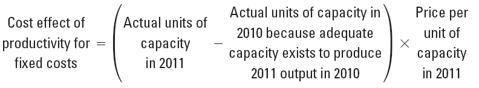

|     | **Strategy, Balanced Scorecard, and** 
                                              
       **Strategic Profitability Analysis**   |
|-----|---------------------------------------|
|     |                                       |

> **Transition Notes**
>
> This chapter has a rewritten discussion on the choice of strategy, making the issues involved in that choice more clear. Rather than linking the balanced scorecard to quality improvement and reengineering, it is introduced after these topics are presented. A discussion of the use of strategy maps with the balanced scorecard is presented in order to create a linked or causal balanced scorecard. There is a renewed emphasis on effective implementation through employee communications. In addition, more discussion is included regarding the balanced scorecard and performance evaluation. The five-step decision-making framework is applied to strategy decisions.

| **Problem Material ** 
                        
 **Correlation Chart**  |
|-----------------------|

|     | **15h ** 
                            
       **Edition**          | **14th ** 
                                                   
                             **Edition**           |     | **15th ** 
                                                                                
                                                          **Edition**           | **14th ** 
                                                                                                       
                                                                                 **Edition**           |
|-----|---------------------|----------------------|-----|----------------------|----------------------|
|     | 16                  | 16 Revised           |     | 29                   | 29 Revised           |
|     | 17                  | 17 Revised           |     | 30                   | 30 Revised           |
|     | 18                  | 18 Revised           |     | 31                   | 31 Revised           |
|     | 19                  | 19 Revised           |     | 32                   | 32 Revised           |
|     | 20                  | 20 Revised           |     | 33                   | 33 Revised           |
|     | 21                  | 21 Revised           |     | 34                   | 34 Revised           |
|     | 22                  | 22 Revised           |     | 35                   | 35 Revised           |
|     | 23                  | 23 Revised           |     | 36                   | 36 Revised           |
|     | 24                  | 24 Revised           |     | 37                   | 37 Revised           |
|     | 25                  | 25 Revised           |     | 38                   | 38 Revised           |
|     | 26                  | 26 Revised           |     | 39                   | 39 Revised           |
|     | 27                  | 27 Revised           |     | 40 New               |                      |
|     | 28                  | 28 Revised           |     | 41 New               |                      |

**I. LEARNING OBJECTIVES**

1.  Recognize which of two generic strategies a company is using.

2.  Understand what comprises reengineering.

3.  Describe the four perspectives of the balanced scorecard.

4.  Analyze changes in operating income to evaluate strategy.

5.  Identify unused capacity and how to manage it.

<!-- -->

1.  **CHAPTER SYNOPSIS**

> Chapter 12 explores the role of strategy in long-range planning, focusing on the two generic strategies of product differentiation and cost leadership.
>
> The balanced scorecard is discussed as a method for implementing and evaluating strategies. The four perspectives of the balanced scorecard—financial, customer service, internal processes, and learning and growth are discussed.
>
> Analysis of changes in operating income using the growth, price-recovery, and productivity components is explored.
>
> Engineered and discretionary costs are defined and distinguished. Capacity utilization is discussed, with a focus on managing unused capacity.

1.  **POINTS OF EMPHASIS**

    1.  Spend substantial time on the balanced scorecard. This is not just the latest management fad; the balanced scorecard is a management tool that is likely to be around for a number of years. It has already been proven to be a valuable performance evaluation tool. However, to fully realize its potential, management must spend an adequate amount of time in preparation and implementation.

> Emphasize that the balanced scorecard is a versatile tool that can be utilized in any type of organization including not-for-profits. Merely substitute the organization’s ultimate objective for the financial perspective.

1.  Problems 12-30, 12-31, 13-22, and 13-23 provide a comprehensive overview of the chapter. You may find it preferable to work through these problems as a part of (or in place of) lecturing on the material.

**IV. CHAPTER OUTLINE**

| **LEARNING **                                                
                                                               
 **OBJECTIVE**                                                 | 1   |
|--------------------------------------------------------------|-----|
| Recognize which of two generic strategies a company is using 
                                                               
 … product differentiation or cost leadership                  |
|                                                              |

1.  *Strategy* specifies how an organization matches its own capabilities with the opportunities in the marketplace to accomplish its objectives.

2.  An organization must create value for its customers, but must differentiate itself from its competitors.

> TEACHING POINT. Brainstorm with the class ways in which an organization may differentiate itself from its competition. Probe further, considering if and how this differentiation creates value for the customer. Move from here to discuss if this will help the company accomplish its objectives. For example, a company may be a low-price leader. By charging the lowest price, it is differentiating itself from others. By giving the customer a lower price, it is creating value for the customer. However, can it do this and meet its profit goals?

1.  In formulating its strategy, the organization must understand the industry in which it operates. Industry analysis focuses on five factors:

-   **Competitors.** Who are your competitors? What are their characteristics?

-   **Potential entrants into the market.** Is your industry one in which there is easy entry or are there barriers to entry?

-   **Equivalent products.** Are there substitute products for yours? For example, if you manufacture paper cups, you are also competing with manufacturers of plastic and Styrofoam cups.

-   **Bargaining power of customers.** Can your product be obtained elsewhere? Do you have a few customers who purchase large quantities?

-   **Bargaining power of input suppliers.** Are there limited sources for your raw materials? Are there only a few potential companies from which you may purchase supplies?

    1.  In setting its strategic direction, one choice available to organizations is **product differentiation.** This is the organization’s ability to offer products or services perceived by customers as superior and unique to those offered by competitors.

    2.  A second strategic choice for organizations is **cost leadership.** Under this approach an organization’s ability to achieve lower costs relative to competitors through productivity and efficiency improvements, elimination of waste, and tight cost control give it a competitive advantage.

> TEACHING POINT. Have the students identify the strategy employed by a number of companies. Wal-Mart will be one of the first mentioned as a cost leader. Probe how companies competing with Wal-Mart can effectively compete.

**Refer to Quiz Question 1**

| **LEARNING **                                                                                  
                                                                                                 
 **OBJECTIVE**                                                                                   | 2   |
|------------------------------------------------------------------------------------------------|-----|
| Understand what comprises reengineering                                                        
                                                                                                 
 … redesigning business processes to improve performance by reducing cost and improving quality  |
|                                                                                                |

> 2.1 **Reengineering** is the fundamental rethinking and redesign of business processes to achieve improvements in critical measures of performance—cost, quality, service, speed, and customer satisfaction.
>
> 2.2 A company would utilize the reengineering process as a key element of cost leadership strategy, as its focus is in that direction.
>
> 2.3 Companies that have successfully undertaken reengineering have found the most benefits when the process cuts across function lines and focuses on the entire business process. Stated another way, reengineering involves every aspect of the company. Reengineering provides only limited benefits when efforts focus on a single activity.

**Refer to Quiz Questions 2 and 3**

| **LEARNING **                                                             
                                                                            
 **OBJECTIVE**                                                              | 3   |
|---------------------------------------------------------------------------|-----|
| Understand the four perspectives of the balanced scorecard                
                                                                            
 … financial, customer, internal business process, and learning and growth  |
|                                                                           |

> 3.1 The **balanced scorecard** translates an organization’s mission and strategy into a set of performance measures that provides the framework for implementing its strategy.
>
> 3.2 It is called the balanced scorecard as it attempts to balance financial and nonfinancial performance measures to evaluate short-run and long-run performance in a single report.
>
> 3.3 In any organization, managers will respond to the measure used to evaluate their performance. This often results in an overemphasis on this performance measure. The balanced scorecard can overcome this by utilizing a set of related performance measures.

1.  The balanced scorecard measures the performance of an organization from four perspectives:

-   **Financial perspective.** This perspective evaluates the profits and value created for shareholders.

<!-- -->

-   **Customer perspective.** This perspective identifies targeted customer and market segments and measures success in these segments.

-   **Internal-business-process perspective.** This perspective focuses on internal operations that create value for customers. This perspective includes three subprocesses:

<!-- -->

-   **Innovation process:** Creating products, services, and processes that will meet the needs of customers

-   **Operations process:** Producing and delivering existing products and services that will meet the needs of the customer

-   **Postsales-service process:** Providing service and support to the customer after the sale of a product or service

<!-- -->

-   **Learning-and-growth perspective.** This perspective identifies the capabilities at which the organization must excel in order to improve the internal processes that create value.

> (Exhibit 12-2 illustrates the interactions among the various perspectives for ChipSet.)
>
> TEACHING POINT. Emphasize that the company will typically identify a limited number of objectives for each perspective, along with a method for measuring results for each initiative. Not all measures would be emphasized each year. Note that the perspectives build on one another. When the company successfully meets its learning and growth objectives, this should translate into improvements in the internal business perspective. This, in turn, will improve the customer perspective and finally result in improved financial performance.
>
> (Exhibit 12-3 presents a balanced scorecard for Chipset.)

1.  Implementing a balanced scorecard is a companywide effort with commitment and leadership from top management an absolute requirement. Without such support, it will not succeed.

2.  Another important aspect of the balanced scorecard is that it must be aligned with strategy. The composition of any particular balanced scorecard will depend on the strategy adopted by the organization.

3.  Managers interested in measuring environmental and social performance are incorporating these factors into their balanced scorecard.

4.  There are several features that are characteristic of a good balanced scorecard.

-   It tells the story of a company’s strategy through a sequence of cause-and-effect relationships.

-   It communicates the strategy to all members of the organization by translating strategy into a coherent and linked set of measurable operational targets.

> TEACHING POINT. The importance of this feature cannot be overemphasized. Numerous companies have failed because management did not adequately communicate its strategy to the rank-and-file.

-   It motivates managers to take actions that eventually result in improvements in financial performance.

> TEACHING POINT. The balanced scorecard helps achieve goal congruence. It rewards managers for taking actions that will increase the value of the company, thus maximizing the managers’ personal wealth.

-   It limits the number of measures, identifying only the most critical ones. By limiting the number of measures, management’s attention can be more focused.

-   It highlights less-than-optimal trade-offs by forcing managers to consider operational and financial measures together.

    1.  Just as there are some features that are characteristic of a good balanced scorecard, there are some pitfalls that should be avoided.

<!-- -->

-   Do not assume the cause-and-effect linkages are precise. They are hypotheses about how they interact. With experience, the company should be able to refine these linkages.

-   Do not seek improvements over all measures all of the time. Keep an eye on the long-run profit maximization. Cost-benefit considerations are critical to a successful balanced scorecard.

-   Do not use only objective measures. Subjective measures such as customer and employee satisfaction ratings should be included.

> TEACHING POINT. Be careful in using such measures as customer satisfaction ratings. One company set a rather high goal for the percentage of positive comment cards returned. They fell far short of the goal, as they failed to realize that dissatisfied customers tended to turn in the cards. Unless a customer was extremely pleased, they would not normally complete a comment card.

-   Do not ignore nonfinancial measures when evaluating managers and other employees. Managers will focus on what measures their performance, so exclusion of these measures will mean that managers give them less importance.

> 3.10 Finally, the company must evaluate the success of its strategy and implementation of the balanced scorecard. This is done by comparing the target and actual performance columns on the scorecard.

**Refer to Quiz Questions 4 and 5 Exercises 12-16 and 12-18 **

| **LEARNING **                                            
                                                           
 **OBJECTIVE**                                             | 4   |
|----------------------------------------------------------|-----|
| Analyze changes in operating income to evaluate strategy 
                                                           
 … growth, price recovery, and productivity                |
|                                                          |

> 4.1 Analyzing income statements for two years will reveal the change in operating income. However, in order to evaluate the success of management’s strategy, that change in operating income must be analyzed, asking “What caused the change?”
>
> 4.2 There are three factors that create changes in operating income:

-   The **growth component** measures the change in operating income attributable solely to the change in the number of units sold.

<!-- -->

-   The growth component can be broken down into two categories:

<!-- -->

-   The **revenue effect of growth** measures the change in revenues due to a change in the number of units sold.

<!-- -->

-   The **cost effect of growth** measures how much costs would have changed based on current year output at prior year input costs. This is also broken down into fixed and variable components.

> 
>
> 

-   The **price-recovery component** measures the change in operating income attributable to change in the prices of inputs and outputs.

    -   The price-recovery component can also be broken down into the revenue and the cost effect categories.

<!-- -->

-   The **revenue effect of price recovery** measures the change in operating income resulting from a change in the selling price from the prior year.

> 

-   The **cost effect of price recovery** measures the change in operating income due to changes in variable or fixed costs of inputs.

> 
>
> 

-   The **productivity component** measures the change in costs attributable to changes in the quantity of inputs. This measures the efficiency in the use of inputs.

    -   The productivity component uses current input prices to measure how costs have changed as a result of using more or fewer inputs, a change in the mix of inputs, or change in capacity utilized to produce current output compared with prior year inputs and capacity.

> 
>
> 
>
> 4.3 In addition to the growth, price-recovery, and productivity component, further analysis is needed. The company’s change in operating income may be the result of a **change in market size** or other favorable economic conditions.
>
> 4.4 If the growth came as a result of a price leadership strategy, the change in operating income from cost leadership should include the productivity gain, change in operating income from productivity-related growth, and any decrease in operating income from lowering prices.
>
> (Exhibit 13-5 illustrates a Strategic Analysis of Profitability.)
>
> 4.5 The **five-step decision-making framework** introduced in Chapter 1 can be applied to strategic decision making.

**Refer to Quiz Questions 6 through 8 Exercises 12-17, 12-19, and 12-20**

| LEARNING                                 
                                           
 OBJECTIVE                                 | 5   |
|------------------------------------------|-----|
| Identify unused capacity                 
                                           
 … capacity available minus capacity used  
                                           
 and how to manage it                      
                                           
 … downsize to reduce capacity             |
|                                          |

> 5.1 Fixed costs, as we have seen, are tied to capacity. In order to manage fixed costs, unused capacity must be measured and managed.
>
> 5.2 **Unused capacity** is defined as the amount of productive capacity available over and above the capacity used to produce current output.
>
> 5.3 An understanding of unused capacity requires distinguishing between *engineered* and *discretionary* costs.

-   **Engineered costs** result from a cause-and-effect relationship between output (the cost driver) and (direct or indirect) resources used to produce the output.

> TEACHING POINT. An engineered cost is one in which the “right” amount can be determined. For example, a company manufacturing tables knows that each table requires four legs. If the cost of a table leg is $5, then the engineered cost of legs for one table is $20. The table does not need five legs; if it has three legs, it will fall over.

-   **Discretionary costs** arise from periodic decisions regarding the maximum amount to be incurred and have no cause-and-effect relationship between output and resources used. There is often a delay in the incurring of a discretionary cost and its use. Examples of discretionary costs include advertising, training, research and development, and public relations.

> TEACHING POINT. A company does not know, for example, the correct amount to spend on advertising. The decision on the advertising budget is made at the beginning of the year and is not tied to units of output. Only in retrospect can management determine if the decision on the amount of advertising was a good one.
>
> 5.4 Having defined unused capacity, it is imperative that the company identify any unused capacity. For engineered conversion costs, capacity can be added or reduced in increments to provide the desired amount of capacity. This is not a difficult task due to the existing cause-and-effect relationship.
>
> 5.5 Identifying unused capacity for discretionary costs is more problematic due to the absence of a cause-and-effect relationship.
>
> 5.6 When excess capacity is identified, it can be eliminated through **downsizing** (also called **rightsizing**). This is an integrated approach of configuring processes, products, and people to match costs to the activities that need to be performed for effective and efficient operations.

**Refer to Quiz Questions 9 and 10 Exercises 12-25 and 12-29 **

> **APPENDIX: PRODUCTIVITY MEASUREMENT**
>
> A.1 **Productivity** measures the relationship between actual inputs used and actual outputs produced. The lower the inputs for a given quantity of outputs, the higher the productivity.
>
> A.2 The most frequently used productivity measure is referred to as **partial productivity.** It expresses productivity as a ratio:
>
> Partial productivity = Quantity of output produced/Quantity of input used
>
> A.3 **Total factor productivity** is the ratio of the quantity of output produced divided by the costs of all inputs based upon current period prices:
>
> Total factor productivity = Quantity of output produced/costs of all inputs used
>
> (Exhibit 12-7 compares Chipset’s productivity in 2012 and 2013)

**Refer to Quiz Question 11 Problems12-40 and 12-41**

**V. Other Resources**

> To download these and other resources, visit the Instructor’s Resource Center [*www.pearsonhighered.com*](http://www.pearsonhighered.com/).
>
> The following exhibits were mentioned in this chapter of the Instructor’s Manual, and have been included in the **PowerPoint Lecture presentation** created specifically for this chapter. You may use the PowerPoint Lecture presentations “as is”, or modify them to suit your individual needs.
>
> Exhibit 12-2 illustrates the interactions among the various perspectives for ChipSet.
>
> Exhibit 12-2 illustrates the Balanced Scorecard for Chipset.

Exhibit 12-5 illustrates a Strategic Analysis of Profitability.

> Exhibit 12-6 compares Chipset’s productivity in 2012 and 2013.

**CHAPTER 12 QUIZ**

1.  Which of the following are two generic strategies described in the text that a company can use?

<!-- -->

1.  Growth and product differentiation

2.  Price recovery and growth

3.  Product differentiation and cost leadership

4.  Cost leadership and price recovery

<!-- -->

1.  Reengineering is a key element in

<!-- -->

1.  cost leadership strategy.

2.  price-recovery strategy.

3.  product-differentiation strategy.

4.  productivity measures.

<!-- -->

1.  Which of the following is the most critical aspect of a successful reengineering process?

<!-- -->

1.  Eliminating unnecessary activities and tasks

2.  Developing employee skills

3.  Changing roles and responsibilities

4.  Working across functional lines to focus on the entire business process

<!-- -->

1.  The balanced scorecard gets its name from

<!-- -->

1.  an attempt to provide short-run financial results with long-run financial strategies.

2.  an attempt to balance product quality and cost reduction.

3.  an attempt to match a company’s own capabilities with the opportunities in the marketplace to accomplish an overall objective.

4.  an attempt to balance financial and nonfinancial performance measures to evaluate both short-run and long-run performance in a single report.

<!-- -->

1.  Creating value for customers describes which one of the four perspectives of the balanced scorecard?

<!-- -->

1.  Financial perspective

2.  Customer perspective

3.  Internal-business-process perspective

4.  Learning-and-growth perspective

<!-- -->

1.  The analysis used for evaluating the success of a strategy through changes in operating income components uses actual results of the current year compared to

<!-- -->

1.  budgeted results for the current year.

2.  actual results for the previous year.

3.  target amounts for the current year.

4.  budgeted results for the previous year.

<!-- -->

1.  The growth in market share is used in calculating the net income effect of

<!-- -->

1.  industry growth.

2.  product differentiation.

3.  cost leadership.

> d. either cost leadership or product differentiation, depending upon the strategy chosen.

8. The following strategic analysis of profitability was prepared for the Corum Company:

> **Revenue and Revenue and **
>
> **Income Cost Effects Cost Effects of Cost Effect of Income**
>
> **Statement of Growth Price-Recovery Productivity Statement**
>
> **Amounts Component Component Component Amounts**
>
> **in 2008 in 2009 in 2009 in 2009 in 2009**
>
> **(1) (2) (3) (4) (5)**
>
> Revenues $300,000 $40,000 F $85,000 F $425,000

Costs *240,000* *24,000* U *34,000* U *$8,000* U *306,000*

Operating income $ 60,000 $ 16,000 F $51,000 F $ 8,000 U $ 119,000

**$59,000 F**

**Change in operating income**

> The market growth rate in the industry was 9 percent in 2009. Sales in 2009 were 17,000 units at $25 each. Corum sold 15,000 units at a unit-selling price of $20 in 2008.
>
> The effect of the industry market size factor for Corum Company in 2009 was
>
> a. $5,200.
>
> b. $10,800.
>
> c. $12,240.
>
> d. $13,500.

1.  A discretionary cost can best be described by which of the following statements?

<!-- -->

1.  The level of uncertainty of deviations of actual amounts from expected results is greater for discretionary costs than for engineered costs.

2.  Discretionary costs result from cause-and-effect relationships between outputs and inputs.

3.  Discretionary costs are added to or subtracted from in a step fashion.

4.  Discretionary costs are variable costs incurred in relation to capacity issues.

<!-- -->

1.  Many companies have tried to *downsize* in an attempt to eliminate

<!-- -->

1.  inefficiencies and waste associated with non-value-added costs.

2.  their unused capacity.

3.  costs associated with both direct and indirect labor.

4.  costs through using information technology.

<!-- -->

1.  \[Appendix\] Which of the following statements is *true* about productivity measures?

<!-- -->

1.  A major disadvantage of total factor productivity is that it measures the combined productivity of all inputs to produce output.

2.  Partial productivity and total factor productivity measures work best together because the strengths of one are the weaknesses of the other.

3.  Total factor productivity is calculated by dividing the costs of all inputs used by the quantity of output produced.

4.  The higher the inputs for a given quantity of outputs or the lower the outputs for a given quantity of inputs, the higher the level of productivity.

CHAPTER 13 QUIZ SOLUTIONS

1. c
====

2. a
====

3. d
====

4. d
====

5. c
====

6. b
====

7. d
====

8. b
====

9. a
====

10. b
=====

11. b
=====

**Quiz Question Calculations**

1.  15,000 units sold in 2008 × 9% growth = 1,350 unit increase due to market size growth

> 17,000 – 15,000 = 2,000 increase in unit sales
>
> $16,000 × 1,350 / 2000 = $10,800
